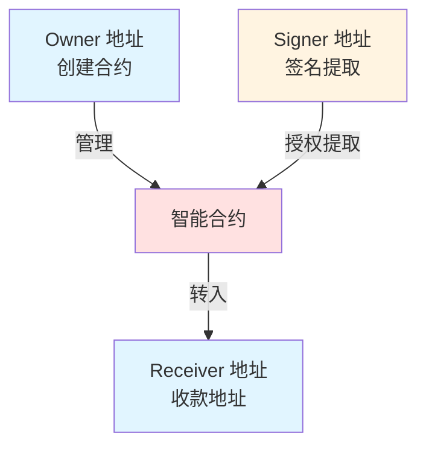
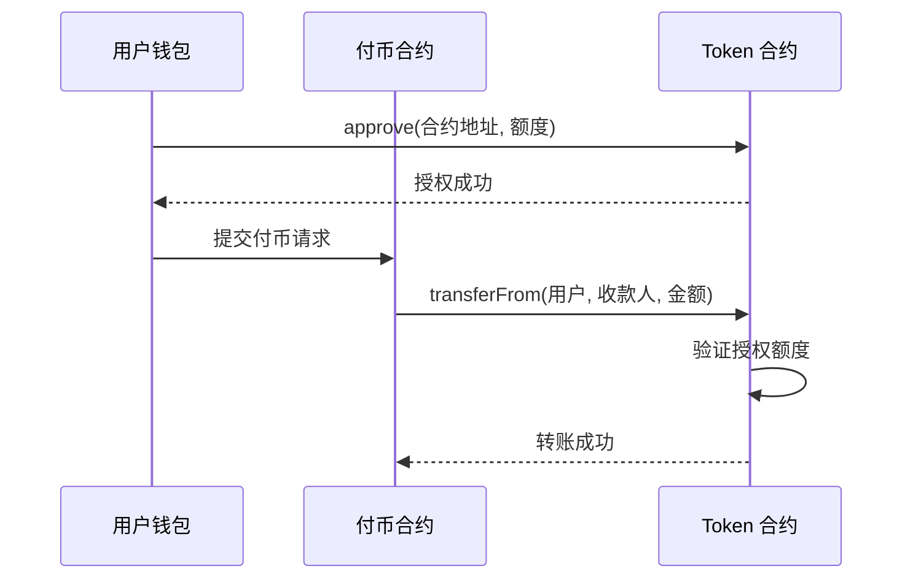

# 核心概念

在开始使用 BlockATM 之前，请先了解以下核心概念。

## 智能合约地址角色

BlockATM 的智能合约涉及三种关键地址角色：

| 角色 | 说明 | 权限 |
|------|------|------|
| **Owner 地址** | 创建合约的地址 | 管理合约配置 |
| **Signer 地址** | 有权从合约提取资金的地址 | 提取资金到 Receiver 地址 |
| **Receiver 地址** | 资金最终到达的地址 | 接收资金 |

### 权限关系图




**安全提醒**：Owner 和 Signer 地址建议使用硬件钱包管理，确保资金安全。一旦合约部署成功，Owner 和 Receiver 地址通常无法修改。


## 授权机制

### 什么是授权 (Approval)？

授权是区块链上的标准 ERC20 操作，允许一个地址（如您的付币合约）代表您支配您的代币。

```
用户 --[授权]--> 付币合约 --[提取]--> 收款人
```

### 授权付币 vs 余额付币

BlockATM 支持两种付币模式：

| 模式 | 说明 | 适用场景 |
|------|------|---------|
| **余额付币** | 使用合约内余额支付 | 合约资金充足时 |
| **授权付币** | 使用用户授权额度支付 | 节省 Gas，无需预存资金到合约 |

### 授权付币流程




**5.8.0 新特性**：V5.8.0 支持任意地址授权给付币合约，不再强制要求白名单。


## 网络与代币

### 支持的网络

| 网络 | 代币标准 | 特点 |
|------|---------|------|
| TRON | TRC20 | 手续费低、速度快 |
| Ethereum | ERC20 | 生态最广泛 |
| Arbitrum | ARB20 | 手续费较低 |

### 常见代币

| 代币 | 网络 | 合约地址 |
|------|------|---------|
| USDT | TRC20/ERC20/ARB20 | - |
| USDC | TRC20/ERC20/ARB20 | - |

## 名词解释

| 名词 | 说明 |
|------|------|
| **Gas** | 区块链网络手续费 |
| **Nonce** | 交易序列号，用于防止重放攻击 |
| **区块确认数** | 交易被区块链确认的区块数量 |
| **链上交易** | 在区块链上实际发生的交易 |
