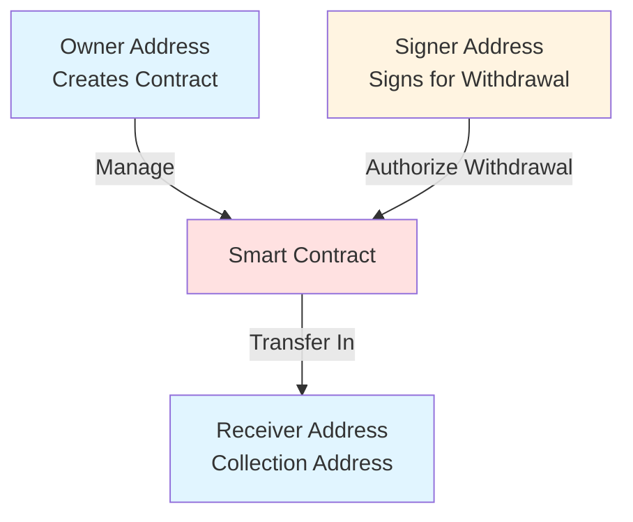
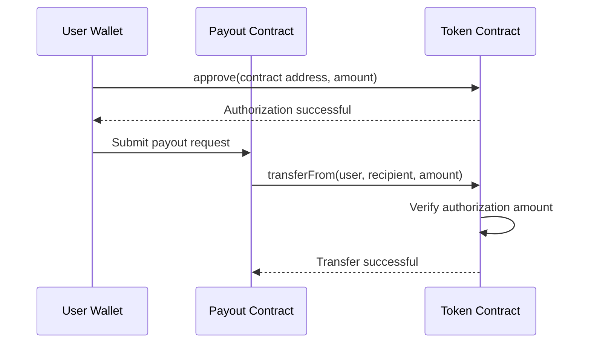

# Core Concepts

Before starting to use BlockATM, please understand the following core concepts.

## Smart Contract Address Roles

BlockATM smart contracts involve three key address roles:

| Role | Description | Permissions |
| --------------- | ------------ | ----------------- |
| **Owner Address** | Address that created the contract | Manage contract configuration |
| **Signer Address** | Address有权从合约提取资金的地址 | Withdraw funds to Receiver address |
| **Receiver Address** | Address where funds ultimately arrive | Receive funds |

### Permission Relationship Diagram




**Security Reminder**: It is recommended to use hardware wallets to manage Owner and Signer addresses to ensure fund security. Once the contract is deployed, Owner and Receiver addresses typically cannot be modified.


## Authorization Mechanism

### What is Authorization (Approval)?

Authorization is a standard ERC20 operation on the blockchain that allows one address (such as your payout contract) to spend your tokens on your behalf.

```
User --[Authorize]--> Payout Contract --[Withdraw]--> Recipient
```

### Authorization Payout vs Balance Payout

BlockATM supports two payout modes:

| Mode | Description | Use Case |
| -------- | ---------- | ---------------- |
| **Balance Payout** | Pay using contract balance | When contract has sufficient funds |
| **Allowance Payout** | Pay using user authorization | Save Gas, no need to pre-fund contract |

### Authorization Payout Flow




**V5.8.0 New Feature**: V5.8.0 supports any address authorizing the payout contract, no longer requiring a whitelist.


## Networks and Tokens

### Supported Networks

| Network | Token Standard | Characteristics |
| -------- | ------ | --------- |
| TRON | TRC-20 | Medium fees, fast speed |
| Ethereum | ERC-20 | Most extensive ecosystem |
| Arbitrum | ERC-20 | Low fees, fast speed |

### Common Tokens

| Token | Network | Contract Address |
| ---- | ------------- | ---- |
| USDT | TRC-20/ERC-20 | - |
| USDC | ERC-20 | - |

## Glossary

| Term | Description |
| --------- | -------------- |
| **Gas** | Blockchain network fee |
| **Nonce** | Transaction sequence number, used to prevent replay attacks |
| **Block Confirmation** | Number of blocks that have confirmed the transaction |
| **On-Chain Transaction** | Transaction that actually occurs on the blockchain |
