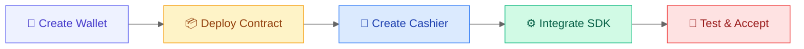

# Quick Start

This guide will help you complete BlockATM's first integration in 15 minutes, from scratch to receiving your first test payment.

## Integration Overview



## Prerequisites Checklist (3 minutes)

Before starting, complete the following preparations:

### 1. Create a Cryptocurrency Wallet

Choose a wallet to create:

**Recommended for Beginners**:

* [Create MetaMask Wallet](../wallets/metamask/create-wallet.md) (5 minutes) - Supports Ethereum/Arbitrum
* [Create TronLink Wallet](../wallets/tronlink/create-wallet.md) (3 minutes) - Supports TRON


**Important**: Be sure to backup your recovery phrase! Lost recovery phrase = lost assets. BlockATM cannot help you recover it.


### 2. Get Test Tokens

Get test tokens based on your chosen network:

| Network | How to Get Test Tokens |
| ---------------- | -------------------------------------------------------------- |
| Ethereum Sepolia | [faucets.chainlinklabs.com](https://faucets.chainlinklabs.com) |
| Arbitrum Sepolia | [faucets.chain.link](https://faucets.chain.link) |
| TRON Nile | [nileex.io](https://nileex.io/join/getJoinPage) |

### 3. Register BlockATM Account

1. Visit [BlockATM Test Environment](https://backstage-b2b-pre.ufcfan.org)
2. Click "Register"
3. Fill in email and password
4. Verify email


**Recommendation**: Familiarize yourself with the process in the test environment first, then use the production environment.


***

## Step 1: Create Collection Contract (5 minutes)

### 1.1 Login to Admin Dashboard

Visit and login:

* Test Environment: https://backstage-b2b-pre.ufcfan.org
* Production Environment: https://app.blockatm.net

### 1.2 Go to Collection Contract Management

1. After login, click "Collection" in the top navigation bar
2. Select "Collection Contract" in the left menu
3. Click "Create Contract" button

### 1.3 Select Contract Type

Select **Web3 Collection Contract** (suitable for beginners):

| Type | Description | Fee |
| -------- | -------- | ------- |
| Web3 Collection | User connects wallet to pay | 2 USD/transaction |
| Scan2Pay | User scans QR code to pay | 0.4%/transaction |

### 1.4 Configure Contract Address

Fill in the following information:

**Signer Address**:

* Address authorized to withdraw funds from the contract
* Recommended to use hardware wallet address
* Example: `0x1234...5678`

**Receiver Address**:

* Address where funds ultimately arrive
* Can be the same as the signer address
* Example: `0xabcd...efgh`


**Important**:

* Double-check the address carefully, it cannot be modified once created
* Recommend testing withdrawal function with a small amount first
* Use hardware wallet to manage large funds


### 1.5 Pay Contract Creation Fee

1. Confirm configuration information
2. Pay 200 USD contract creation fee
3. Wait for contract deployment (~1-2 minutes)
4. After successful deployment, record the contract ID

***

## Step 2: Create Cashier (3 minutes)

### 2.1 Go to Cashier Management

1. Click "Cashier" in the top navigation bar
2. Click "Create Cashier"

### 2.2 Fill in Merchant Information

* **Merchant Name**: Your business name
* **Merchant Description**: Brief business description
* **Contact Email**: Email for notifications

### 2.3 Select Network and Token

**Supported Networks**:

* ✅ Ethereum (ERC20)
* ✅ Arbitrum (ARB20)
* ✅ TRON (TRC20)

**Supported Tokens**:

* USDT (recommended)
* USDC
* DAI
* Other ERC20/TRC20 tokens

### 2.4 Enable Payment Methods

Select at least one payment method:

**Wallet Connect Payment**:

* ✅ Good user experience
* ✅ Accurate payment amount
* Suitable for: Desktop

**Scan Payment**:

* ✅ No wallet connection required
* ✅ Suitable for mobile
* Suitable for: Mobile users

### 2.5 Bind Collection Contract

1. Select the collection contract you just created
2. A contract can only be bound to one cashier
3. Click "Preview Cashier" to see the effect
4. After confirmation, click "Create"

### 2.6 Get Integration Information

After successful creation, click "Integrate" button to get:

* **Cashier ID**: `cs_xxxxxx`
* **API Key** (Public Key): `pck_xxxxxx`
* **Secret Key** (Private Key): `sck_xxxxxx` ⚠️ Keep confidential
* **Webhook Key**: Used to verify notification signatures


**Important**: Secret Key is displayed only once! Please copy and save it securely immediately.


***

## Step 3: Integrate Cashier (5 minutes)

### 3.1 Create Test Page

Create a new HTML file on your computer:

```html
<!DOCTYPE html>
<html lang="en">
<head>
  <meta charset="UTF-8">
  <meta name="viewport" content="width=device-width, initial-scale=1.0">
  <title>BlockATM Payment Test</title>
  <style>
    body {
      font-family: Arial, sans-serif;
      max-width: 600px;
      margin: 50px auto;
      padding: 20px;
    }
    #blockatm-container {
      min-height: 500px;
      border: 1px solid #ddd;
      border-radius: 8px;
      margin-top: 20px;
    }
    .status {
      padding: 10px;
      margin: 10px 0;
      border-radius: 4px;
    }
    .success { background: #d4edda; color: #155724; }
    .error { background: #f8d7da; color: #721c24; }
  </style>
</head>
<body>
  <h1>🎉 BlockATM Payment Test</h1>

  <div id="status"></div>
  <div id="blockatm-container"></div>

  <!--引入 BlockATM SDK -->
  <script src="https://test-pay.blockatm.net/libs/v2/BlockATM.umd.js?apiKey=YOUR_API_KEY"></script>

  <script>
    // 替换为您的实际值
    const CASHIER_ID = 'YOUR_CASHIER_ID';
    const ORDER_NO = 'ORDER_' + Date.now();
    const AMOUNT = '10'; // 测试金额：10 USDT
    const SYMBOL = 'USDT';
    const CHAIN_ID = 'TRON'; // 或 'ETHEREUM', 'ARBITRUM'

    // 初始化收银台
    window.BlockATM.init(
      document.getElementById('blockatm-container'),
      {
        cashierId: CASHIER_ID,
        orderNo: ORDER_NO,
        amount: AMOUNT,
        symbol: SYMBOL,
        chainId: CHAIN_ID,
        lang: 'en-US',
        callback: function(result) {
          const statusDiv = document.getElementById('status');

          if (result.type === 'finish') {
            statusDiv.className = 'status success';
            statusDiv.innerHTML = '✅ Payment successful! Order: ' + result.data.orderNo;
            console.log('Payment success:', result.data);
          } else if (result.type === 'cancel') {
            statusDiv.className = 'status error';
            statusDiv.innerHTML = '❌ User cancelled payment';
          } else {
            statusDiv.className = 'status error';
            statusDiv.innerHTML = '❌ Payment failed: ' + result.message;
          }
        }
      }
    );
  </script>
</body>
</html>
```

### 3.2 Replace Configuration Values

Replace the following values with the information you obtained in 2.6:

```javascript
const CASHIER_ID = 'cs_xxxxxx';  // Replace with your Cashier ID
const API_KEY = 'pck_xxxxxx';    // Replace with your API Key
```

### 3.3 Open in Browser

1. Double-click the HTML file to open in browser
2. Or use a local server:

    ```bash
    # Using Python
    python -m http.server 8000
    # Visit http://localhost:8000/your-file.html
    ```

### 3.4 Test Payment

1. After the page loads, the cashier will be displayed
2. Click "Connect Wallet"
3. Select the wallet you created (MetaMask or TronLink)
4. Authorize payment
5. Confirm transaction


**Note**: Please use test tokens in the test environment, do not use real funds!


### 3.5 Verify Payment Result

After successful payment, you will see:

1. Page shows "✅ Payment Successful"
2. Browser console outputs order details
3. Admin dashboard order status updates
4. If Webhook is configured, you will receive a notification

***

## Verification Checklist

Complete the following checks to ensure successful integration:

* [ ] ✅ Cashier displays correctly on the page
* [ ] ✅ Wallet connects successfully
* [ ] ✅ Can see supported token list
* [ ] ✅ Payment amount displays correctly
* [ ] ✅ Wallet authorization transaction successful
* [ ] ✅ Success message displays after payment
* [ ] ✅ Admin dashboard order status updates
* [ ] ✅ (Optional) Webhook receives notification

***

## Troubleshooting

### Problem 1: Cashier Not Displaying

**Possible Causes**:

* Incorrect API Key
* Cashier not activated
* Browser console has errors

**Solutions**:

1. Check if API Key is correct
2. Confirm cashier status is "active" in admin dashboard
3. Open browser console (F12) to check errors

### Problem 2: Wallet Connection Failed

**Possible Causes**:

* Wallet plugin not installed
* Wallet not unlocked
* Network mismatch

**Solutions**:

1. Confirm MetaMask or TronLink is installed
2. Unlock wallet (enter password)
3. Switch to correct network (TRON/Ethereum/Arbitrum)

### Problem 3: Payment Failed

**Possible Causes**:

* Insufficient balance
* Insufficient Gas
* Network congestion

**Solutions**:

1. Check if wallet balance is sufficient
2. Ensure sufficient Gas (TRX/ETH)
3. Wait a few minutes and retry

***

## Next Steps

After successful integration, you can:

### Deep Learning

* [Complete Collection Integration Guide](../getting-started/guides/collect-guide.md) - Detailed integration process
* [Open API Documentation](../getting-started/open-api/) - Backend integration
* [Webhook Configuration](../getting-started/webhooks/) - Receive payment notifications

### Production Deployment

1. Create contracts and cashier in production environment
2. Update SDK URL to production environment
3. Use real API Key
4. Configure Webhook to receive real payment notifications

### Advanced Features

* [Payout Function](../getting-started/guides/payout-guide.md) - Batch payment
* [Allowance Mode](../getting-started/products/batch-payout/allowance-mode.md) - Improve capital efficiency
* [Exception Handling](../getting-started/guides/exception-handling.md) - Handle failed orders

***

## Need Help?

* 💬 Telegram: Passto_john
* 📧 Email: john.feng@chixi88.com
* 📖 [FAQ](../faq/)


**Congratulations!** You have completed BlockATM's first integration. Continue exploring more features!

