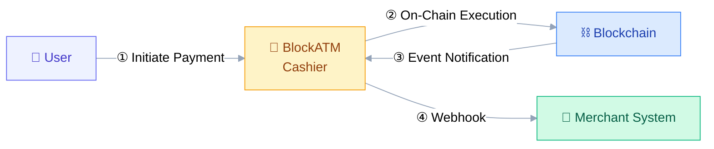
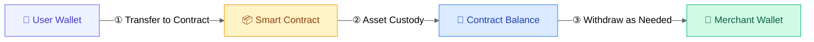
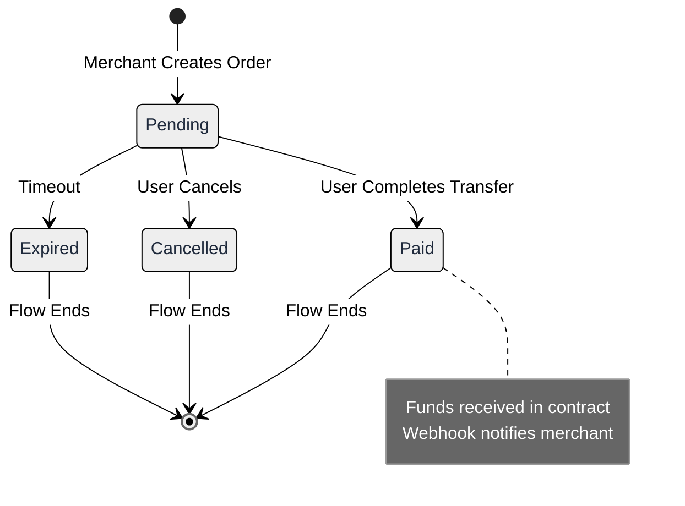

# Overview

BlockATM is the world's first decentralized cryptocurrency payment protocol, based on blockchain smart contract technology, providing businesses with a secure, self-custodial payment solution.

## Differences from Traditional Payment

| Comparison | Traditional Payment | BlockATM |
|------------|---------|---------|
| Fund Custody | Payment institution custody | Smart contract custody |
| Control | Payment institution controls | Enterprise has full control |
| Withdrawal Limits | Amount and time limits | No limits |
| Settlement Speed | 1-3 business days | Real-time |
| Fee Transparency | Complex billing | Fixed rate |

## Core Features

### 🔐 Self-Custody

Your smart contracts are owned by the enterprise, deployed on the blockchain, publicly transparent, and immutable. Only your designated **Signer address** can withdraw assets from the contract. BlockATM cannot access your funds.

### 🌐 Permissionless

Asset withdrawal requires no authorization from anyone, no amount limits, no time limits. Withdraw anytime, 24/7.

### 🔗 Multi-Chain Support

Supports mainstream blockchain networks:
- **TRON** (TRC20) - Low fees, high throughput
- **Ethereum** (ERC20) - Most widely used
- **Arbitrum** (ARB20) - Ethereum Layer 2

### 💰 Transparent Fees

| Service | Fee |
|------|------|
| Smart Contract Creation | 200 USD/contract |
| Collection (Wallet Connect) | 2 USD/transaction |
| Collection (Scan Payment) | 0.4%/transaction |
| Payout | 1 USD/transaction |

## System Architecture

**Supported Networks**: TRON (TRC-20) · Ethereum (ERC-20) · Arbitrum (ARB-20)

## Fund Flow

## Payment Flow

## Use Cases

- ✅ **E-commerce Collection** - Accept cryptocurrency payments, manage funds independently
- ✅ **Batch Payout** - Automated payments to users, no manual transfers
- ✅ **Fund Collection** - Automatically collect user payments to designated address
- ✅ **DApp Integration** - Embed cryptocurrency payments in your application


**No KYB/KYC Required**: BlockATM is a decentralized application; enterprises do not need to submit identity verification materials to any institution.

