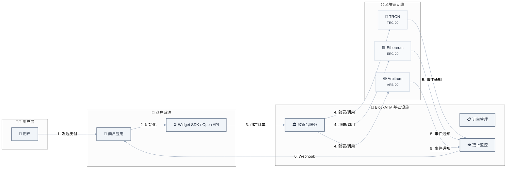
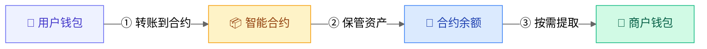
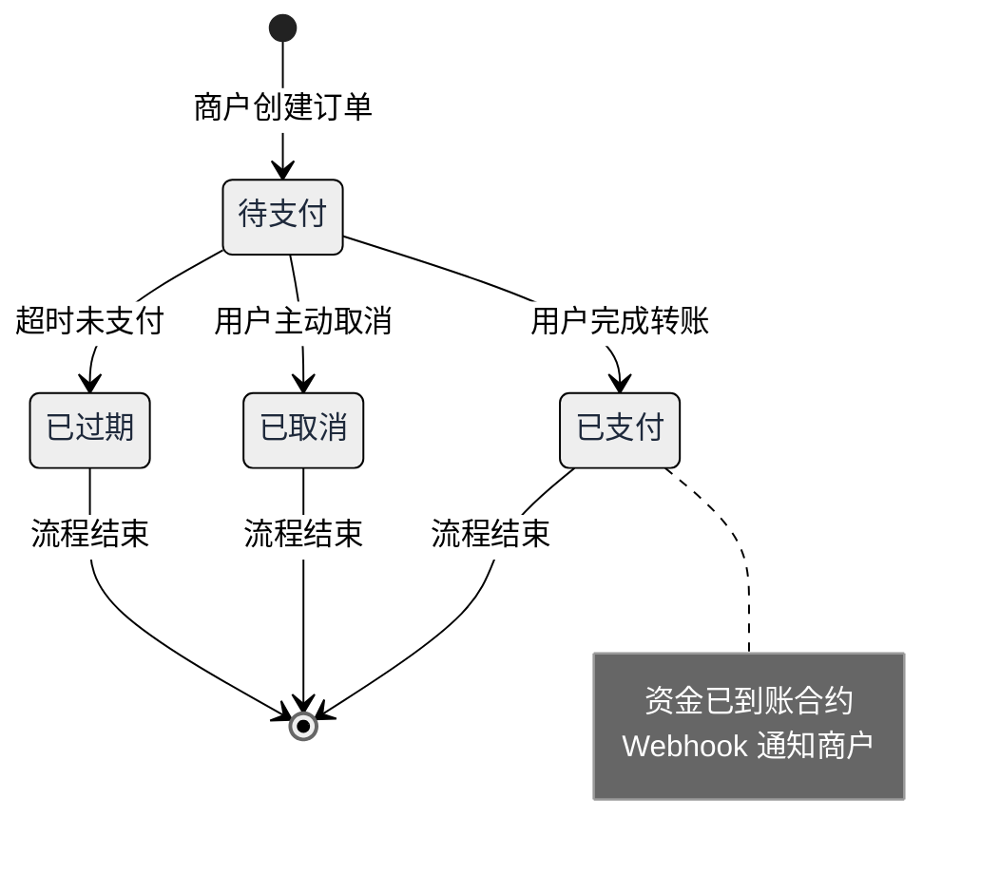

# BlockATM 概述

BlockATM 是全球首个去中心化加密货币支付协议，基于区块链智能合约技术，为企业提供安全、自托管的支付解决方案。

## 与传统支付的区别

| 对比项 | 传统支付 | BlockATM |
|--------|---------|---------|
| 资金托管 | 支付机构托管 | 智能合约托管 |
| 控制权 | 支付机构控制 | 企业完全自主 |
| 提现限制 | 有金额和时间限制 | 无限制 |
| 结算速度 | 1-3 个工作日 | 实时到账 |
| 费用透明 | 复杂计费 | 固定费率 |

## 核心特性

### 🔐 自主托管

您的智能合约归企业所有，部署在区块链上，公开透明、不可篡改。只有您指定的**签名地址**才能从合约提取资产，BlockATM 无法访问您的资金。

### 🌐 无需许可

资产提取无需任何人授权，没有金额限制，没有时间限制。7×24 小时随时可提。

### 🔗 多链支持

支持主流区块链网络：
- **TRON** (TRC20) - 低手续费、高吞吐量
- **Ethereum** (ERC20) - 最广泛使用
- **Arbitrum** (ARB20) - Ethereum Layer 2

### 💰 透明费率

| 服务 | 费用 |
|------|------|
| 创建智能合约 | 200 USD/个 |
| 收币（钱包连接） | 2 USD/笔 |
| 收币（扫码支付） | 0.4%/笔 |
| 付币 | 1 USD/笔 |

## 系统架构

## 资金流向

## 支付流程

## 适用场景

- ✅ **电商收款** - 接受加密货币支付，自主管理资金
- ✅ **批量付币** - 自动化向用户支付，无需手动转账
- ✅ **资金归集** - 将用户付款自动归集到指定地址
- ✅ **DApp 集成** - 在您的应用中嵌入加密货币支付


**不需要 KYB/KYC**：BlockATM 是去中心化应用，企业无需向任何机构提交身份证明材料。

