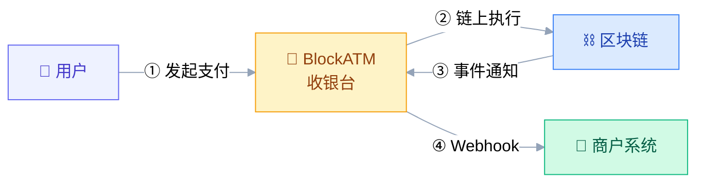
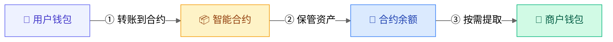
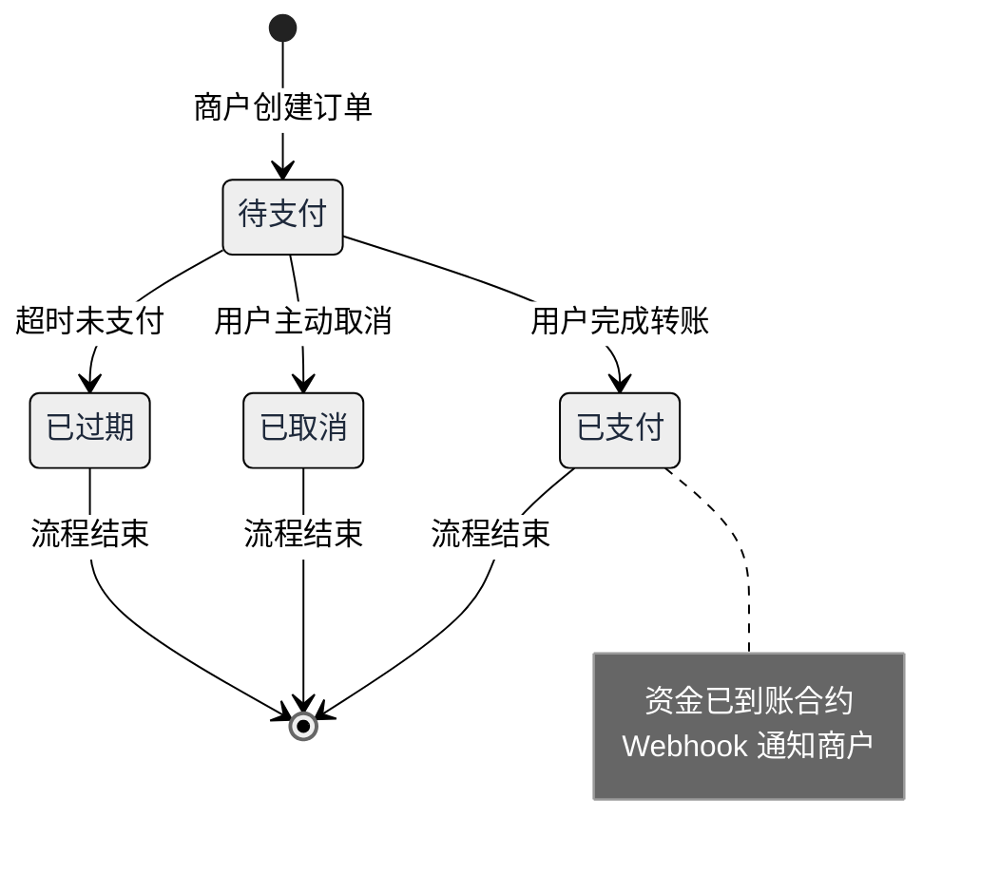

# 概述

BlockATM 是面向企业的自托管 Web3 支付协议。它通过区块链智能合约帮助企业完成加密货币收款、批量付币和链上资金管理，让企业在保持资金控制权的同时，获得更清晰的费用规则和更简单的 GAS 使用体验。

与传统托管型支付服务不同，BlockATM 不以“替企业保管资金”为核心。平台负责协调支付流程、订单状态、通知和接入能力；资金则保留在企业可控制的钱包和智能合约权限体系中。

对运营、财务和管理员来说，BlockATM 的核心价值可以概括为三点：资金不交给平台托管，费用规则清楚可预估，支付和付币流程中无需额外准备原生代币付 GAS。

### 为什么企业选择 BlockATM

企业接入加密货币支付时，最常见的顾虑不是“能不能收款”，而是资金是否安全、费用是否透明、财务是否能对账、日常操作是否容易出错。

**BlockATM 把这些问题放在产品设计的第一层**

## 与传统支付的区别

<table><thead><tr><th width="127.0625">对比项</th><th>传统托管型加密支付</th><th>BlockATM</th></tr></thead><tbody><tr><td>资金托管</td><td>资金通常先进入平台或支付机构账户</td><td>资金进入企业自主控制的智能合约和钱包权限体系</td></tr><tr><td>控制权</td><td>提现、冻结、限额依赖平台规则</td><td>企业通过指定签名钱包地址和权限管理关键操作</td></tr><tr><td>费用体验</td><td>计费口径可能分散在不同服务和链上操作中</td><td>收币、付币、合约创建费用清晰展示</td></tr><tr><td>GAS 体验</td><td>用户或商户可能需要准备原生代币</td><td>支持无需额外准备原生代币付 GAS 的支付体验</td></tr><tr><td>财务对账</td><td>需要依赖平台账单和链上记录交叉核对</td><td>订单、交易哈希、合约余额和事件通知可追踪</td></tr><tr><td>安全理念</td><td>完全相信平台托管资产</td><td>平台协调流程，企业自主掌握资金控制权</td></tr></tbody></table>

 

## 核心特性

#### 1.自托管资金

BlockATM 的资金控制模型建立在智能合约和企业指定钱包之上。企业可以通过签名地址和权限配置管理关键操作，BlockATM 不以托管方身份直接控制或提取企业资金。

这对企业意味着：资金归属更清楚，操作边界更明确，也更便于在内部建立复核、审计和权限管理流程。

#### 2.费用清晰

BlockATM 将核心费用拆分为企业容易理解的项目，包括合约创建、收币和付币。财务团队可以在上线前评估长期成本，也可以在运营过程中用订单记录和链上记录进行核对。

| 服务       | 费用        |
| -------- | --------- |
| 创建智能合约   | 200 USD/个 |
| 收币（钱包连接） | 2 USD/笔   |
| 收币（扫码支付） | 0.4%/笔    |
| 付币       | 1 USD/笔   |

#### 3.无需原生代币付 GAS

Web3 支付常见的使用门槛，是用户或商户需要额外准备 TRX、ETH 等原生代币来支付链上 GAS。BlockATM 在支持的支付与付币流程中，降低了这一步带来的操作成本。

对运营来说，用户支付路径更短，客服解释成本更低；对财务来说，费用口径更统一；对管理员来说，日常钱包维护更简单。

#### 4.多链支持

BlockATM 支持主流区块链网络，覆盖常见稳定币收付款场景：

* TRON（TRC20）：适合高频、低成本的稳定币支付场景。
* Ethereum（ERC20）：适合主流资产和生态兼容需求。
* Arbitrum（ARB20）：适合需要以太坊生态兼容和更低链上成本的场景。

#### 5.链上透明与事件通知

每一笔收款、付币和订单状态变化，都可以通过链上交易记录、订单状态和 Webhook 事件进行追踪。企业可以把 BlockATM 接入现有订单、财务或风控系统，让运营处理、财务对账和异常追溯更统一。

## 系统架构

在 BlockATM 的支付流程中，用户、BlockATM 收银台、区块链和商户系统共同完成一次支付：

1. 用户在商户页面或收银台发起支付。
2. BlockATM 生成支付订单和链上支付信息。
3. 用户完成链上转账。
4. 区块链确认交易。
5. BlockATM 通过 Webhook 将支付结果通知商户系统。

## 资金流向

BlockATM 的资金流向可以理解为三个阶段：

| 阶段   | 说明                             |
| ---- | ------------------------------ |
| 用户付款 | 用户将加密货币支付到指定合约。                |
| 合约记录 | 资金和交易记录在链上形成可追踪凭证。             |
| 企业控制 | 企业通过指定钱包、签名地址和权限规则管理后续提取或付币操作。 |

这套设计减少了中心化托管风险，也让企业在财务、审计和异常排查时有更清晰的依据。\
 

## 支付流程

一次收款通常会经历以下状态：

<table><thead><tr><th width="120.875">状态</th><th>对运营意味着什么</th><th>对财务意味着什么</th></tr></thead><tbody><tr><td>待支付</td><td>用户还未完成付款，可继续引导支付或等待超时。</td><td>不计入已收款金额。</td></tr><tr><td>已支付</td><td>链上付款完成，系统可通知商户发货或入账。</td><td>可根据订单、交易哈希和金额进行核对。</td></tr><tr><td>已取消</td><td>用户主动取消支付流程。</td><td>无需入账，但可保留订单记录。</td></tr><tr><td>已过期</td><td>用户在有效时间内未完成支付。</td><td>不计入收入，可作为运营转化分析数据。</td></tr></tbody></table>

## 适用场景

<table><thead><tr><th width="140.125">场景</th><th width="201.1875">适合团队</th><th>价值</th></tr></thead><tbody><tr><td>电商收款</td><td>运营、财务</td><td>接受稳定币付款，减少托管型收款带来的资金控制问题。</td></tr><tr><td>批量付币</td><td>财务、管理员</td><td>向用户、合作方或供应商批量付款，并保留交易记录。</td></tr><tr><td>资金归集</td><td>财务、管理员</td><td>将多笔用户付款归集到企业可管理的钱包和合约体系中。</td></tr><tr><td>DApp 集成</td><td>管理员、技术协作方</td><td>在现有产品中接入加密货币支付能力。</td></tr></tbody></table>


**不需要 KYB/KYC**：BlockATM 是去中心化应用，企业无需向任何机构提交身份证明材料。


如果你是第一次了解 BlockATM，建议按下面顺序继续阅读：

* [核心概念](core-concepts.md)：理解自托管、签名地址、合约余额和订单状态。
* [收币概述](../products/safepay/)：了解 Safepay 如何完成加密货币收款。
* [付币概述](https://app.gitbook.com/s/XEfzS05BPO0tTODCeSnr/fu-bi)：了解 Batch Payout 如何进行批量付币。
* [安全最佳实践](../security/best-practices.md)：配置企业钱包、权限和复核流程。

 
