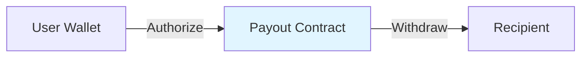

# V2.3.0 Changelog

> **Release Date**: 2026-01-13
> **Version**: V2.3.0

---

## Overview

V2.3.0 introduces the **Allowance Management Mode**, which allows users to authorize contracts to spend their tokens without pre-depositing funds into the contract.

## Major Updates

### New Features

| Feature | Description |
|------|------|
| Allowance management page | Visual management of allowance status |
| Allowance payout mode | Payout based on on-chain allowance |
| Allowance payout contract | New contract type supporting allowance payout |
| Monitoring alerts | Allowance monitoring and alerts |

## Allowance Management Mode

### How It Works

### Core Features

| Feature | Description |
|------|------|
| No Pre-deposit | User authorizes, no need to deposit to contract |
| On-chain Verification | Allowance queried in real-time from on-chain |
| Flexible Dispatch | Can pay from multiple authorized addresses |

## Contract Creation Enhancements

### New Configuration

When creating payout contracts, new mode selection:

| Mode | Description |
|------|------|
| Balance Mode | Traditional mode, funds pre-deposited to contract |
| Allowance Mode | New mode, based on user authorization |

## Asset Page Optimization

### Allowance Management Entry

- Allowance mode contracts show "Allowance Management" button
- Hide "Deposit" button
- New allowance amount tooltip

## Compatibility


V2.3.0 is fully compatible with V2.2.0. Existing integrations do not need modification.



**Note**: Using allowance payout function requires creating a new contract (V2.3.0+ version contract).

