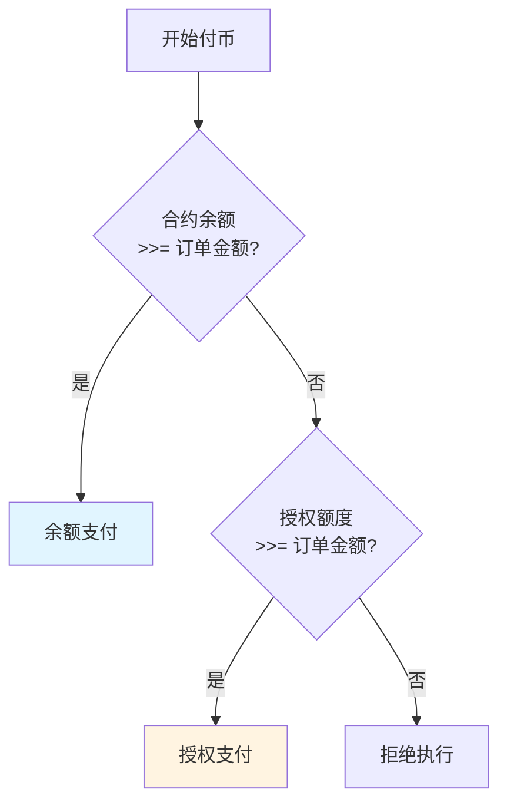

# V5.8.0 更新日志

> **发布日期**：2026-XX-XX
> **版本**：V5.8.0

---

## 概述

V5.8.0 是重大版本更新，**统一了支付方式**，将授权付币从独立功能提升为核心支付选项，并简化了授权管理流程。

## 核心变更

### 1. 概念清晰化

| 旧概念 | 新概念 |
|-------|-------|
| 授权型合约（合约类型） | 授权支付（支付方式） |
| 余额型合约（合约类型） | 余额支付（支付方式） |

### 2. 授权地址变更

| 变更项 | 旧版本 | V5.8.0 |
|-------|-------|--------|
| 授权地址数量 | 固定 1 个 | 任意多个 |
| 传入方式 | 构造函数预置 | 方法参数动态传入 |
| 白名单要求 | 强制 | 不强制 |

### 3. 事件监听升级

| 变更项 | 说明 |
|--------|------|
| 实时监听 | Web3j Flowable 实时监听 Approval 事件 |
| 轮询备份 | 定时轮询补漏 |
| 去重机制 | txHash + logIndex 唯一约束 |

## 支付方式选择




**重要**：余额支付和授权支付**二选一**，不支持混合支付。


## 新增功能

| 功能 | 说明 |
|------|------|
| 授权管理页面 | 集成到管理后台，无需独立 DApp |
| 建议授权额度 | 根据待付订单自动计算 |
| 授权历史 | 查看授权变更记录 |

## 合约变更

### 构造函数

```solidity
// V5.8.0 构造函数（移除 newColdWalletAddress）
constructor(
    bool _safe,
    uint256 _contractId,
    address[] memory _financeList,
    address _factoryAddress,
    address _feeGateway
    // 不再需要 newColdWalletAddress 参数
)
```

### payoutWithAllowance 新签名

```solidity
// V5.8.0 新增 from 参数
function payoutWithAllowance(
    address token,
    address from,              // 新增：授权地址
    address[] memory recipients,
    uint256[] memory amounts,
    uint256 totalFee,
    bytes memory signature,
    uint256 nonce,
    uint256 timestamp
) external onlyPacker returns (bool)
```

## 迁移指南


**重要**：V5.8.0 需要部署新合约。


### 迁移步骤

1. **部署新合约**
   - 使用 V5.8.0 合约代码部署新合约

2. **迁移配置**
   - 将白名单从旧合约迁移到新合约
   - 将财务地址配置到新合约

3. **切换系统配置**
   - 在 BlockATM 管理后台更新合约地址

### 迁移对比

| 数据 | 迁移方式 |
|------|---------|
| 客户白名单 | 手动通过 addCustomers 批量添加 |
| 财务地址 | 手动通过 setFinanceAddress 设置 |
| 打包地址 | 手动通过 setPacker 设置 |
| Owner | 部署时自动设置 |

## 兼容性


**向后兼容**：V5.8.0 合约保留原有接口，余额支付功能不变。


## 性能提升

| 指标 | 提升 |
|------|------|
| 授权查询响应 | < 500ms |
| 支付执行响应 | < 2s |
| 事件监听延迟 | < 10s |
