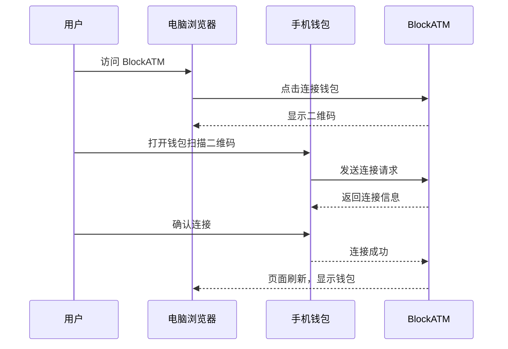

# WalletConnect

WalletConnect 是连接去中心化应用（DApps）与移动端钱包的开放协议。

## 什么是 WalletConnect？

WalletConnect 允许您使用移动钱包（如 Trust Wallet、TokenPocket 等）连接到桌面端的 DApp，通过扫描二维码完成安全连接。

## 产品概述

| 特性   | 说明                                             |
| ---- | ---------------------------------------------- |
| 协议类型 | 开放协议                                           |
| 支持钱包 | 300+ 钱包                                        |
| 支持网络 | 多链（EVM + 非 EVM）                                |
| 官网   | [walletconnect.org](https://walletconnect.org) |
| 特点   | 扫码连接、端到端加密                                     |

## 支持的钱包

WalletConnect 支持 300+ 钱包，以下是常用钱包：

| 钱包              | 平台          | 官网                                             |
| --------------- | ----------- | ---------------------------------------------- |
| Trust Wallet    | iOS/Android | [trustwallet.com](https://trustwallet.com)     |
| TokenPocket     | iOS/Android | [tokenpocket.pro](https://www.tokenpocket.pro) |
| imToken         | iOS/Android | [imtoken.io](https://imtoken.io)               |
| MetaMask Mobile | iOS/Android | [metamask.io](https://metamask.io)             |
| Rainbow         | iOS/Android | [rainbow.me](https://rainbow.me)               |


**提示**：几乎所有主流移动钱包都支持 WalletConnect。在钱包中寻找"WalletConnect"或"扫描二维码"功能。


## 为什么使用 WalletConnect？

### ✅ 优势

* **支持多种钱包**：不限制特定钱包品牌
* **移动端友好**：专为移动用户设计
* **安全性高**：端到端加密，私钥不离开手机
* **便捷**：扫码即可连接，无需安装浏览器插件
* **多会话**：可同时连接多个 DApp

### ⚠️ 限制

* **需要移动钱包**：必须有支持 WalletConnect 的移动钱包
* **需要手机参与**：每笔交易需要手机确认
* **依赖网络**：手机和网络需保持连接

## 连接步骤

### 步骤 1：准备移动钱包

1. 在手机应用商店下载支持 WalletConnect 的钱包
2. 创建或导入钱包
3. 确保钱包有余额（用于测试）

### 步骤 2：在 BlockATM 选择 WalletConnect

1. 访问 BlockATM 管理后台
2. 点击"连接钱包"
3. 选择"WalletConnect"选项
4. 页面显示二维码

### 步骤 3：扫描二维码

1. 打开移动钱包 App
2. 找到"发现"、"浏览器"或"扫描"功能
3. 选择"WalletConnect"或"扫描二维码"
4. 扫描 BlockATM 页面上的二维码

### 步骤 4：授权连接

1. 钱包 App 会显示连接请求
2. 检查网站信息
3. 点击"连接"或"授权"
4. 连接成功后，BlockATM 页面自动刷新

### 步骤 5：验证连接

连接成功后，您会看到：

* 钱包地址显示
* 账户余额（如适用）
* 可以进行收币/付币操作

## 使用流程

## 进行交易

使用 WalletConnect 进行交易的流程：

1. **发起交易**：在 BlockATM 页面点击操作（如支付、授权）
2. **推送请求**：交易请求推送到手机钱包
3. **手机确认**：在手机钱包查看交易详情并确认
4. **执行交易**：钱包签名并广播到区块链
5. **返回结果**：BlockATM 收到结果并更新页面


**提示**：确保手机网络畅通，否则无法收到交易请求。


## 管理连接

### 查看已连接的 DApp

在钱包 App 中：

1. 进入"设置"或"个人资料"
2. 找到"WalletConnect"或"已连接的 DApp"
3. 查看和管理连接

### 断开连接

**方式 A：在 BlockATM 断开**

1. 点击页面右上角钱包地址
2. 选择"断开连接"

**方式 B：在钱包断开**

1. 打开钱包 App
2. 进入 WalletConnect 管理
3. 找到 BlockATM
4. 点击"断开"

## 常见问题

### 二维码过期了怎么办？

二维码有时效性。刷新页面重新获取二维码即可。

### 扫码后没反应？

**可能原因**：

* 网络延迟
* 钱包版本过旧
* WalletConnect 协议版本不匹配

**解决方法**：

1. 检查手机网络
2. 更新钱包到最新版本
3. 刷新 BlockATM 页面重试

### 收不到交易请求？

**检查项**：

* 手机网络是否畅通
* 钱包通知权限是否开启
* 钱包是否在后台运行

### 支持哪些网络？

WalletConnect 支持多个网络：

* Ethereum (ERC20)
* TRON (TRC20)
* Arbitrum
* BSC
* Polygon
* 等等

具体支持情况取决于您的钱包。

## 安全提示


**安全提醒**：

* 只扫描 BlockATM 官方的二维码
* 连接前检查网站域名
* 不要授权不明的交易请求
* 定期清理不再使用的 DApp 连接


## 下一步

* [创建收币合约 →](../../../wallets/integration/guides/collect-guide.md)
* [获取测试币 →](../../../wallets/getting-started/supported-networks.md)
* [开始收币集成 →](../../../wallets/integration/guides/collect-guide.md)
