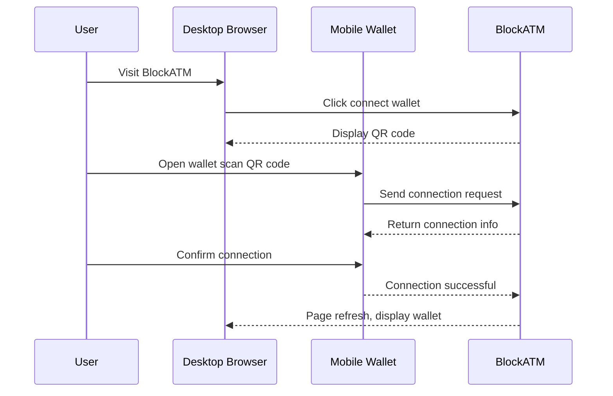

# WalletConnect

WalletConnect is an open protocol for connecting decentralized applications (DApps) with mobile wallets.

## What is WalletConnect?

WalletConnect allows you to use mobile wallets (such as Trust Wallet, TokenPocket, etc.) to connect to desktop DApps, completing secure connections by scanning QR codes.

## Product Overview

| Feature | Description |
| ---- | ---------------------------------------------- |
| Protocol Type | Open protocol |
| Supported Wallets | 300+ wallets |
| Supported Networks | Multi-chain (EVM + non-EVM) |
| Official Website | [walletconnect.org](https://walletconnect.org) |
| Features | QR code connection, end-to-end encryption |

## Supported Wallets

WalletConnect supports 300+ wallets. Here are commonly used wallets:

| Wallet | Platform | Official Website |
| --------------- | ----------- | ---------------------------------------------- |
| Trust Wallet | iOS/Android | [trustwallet.com](https://trustwallet.com) |
| TokenPocket | iOS/Android | [tokenpocket.pro](https://www.tokenpocket.pro) |
| imToken | iOS/Android | [imtoken.io](https://imtoken.io) |
| MetaMask Mobile | iOS/Android | [metamask.io](https://metamask.io) |
| Rainbow | iOS/Android | [rainbow.me](https://rainbow.me) |


**Note**: Almost all mainstream mobile wallets support WalletConnect. Look for "WalletConnect" or "Scan QR Code" function in wallet.


## Why Use WalletConnect?

### ✅ Advantages

* **Multi-wallet Support**: Not restricted to specific wallet brand
* **Mobile-friendly**: Designed for mobile users
* **High Security**: End-to-end encryption, private key never leaves phone
* **Convenient**: Scan QR code to connect, no browser extension needed
* **Multi-session**: Can connect to multiple DApps simultaneously

### ⚠️ Limitations

* **Mobile Wallet Required**: Must have mobile wallet supporting WalletConnect
* **Phone Required**: Each transaction needs phone confirmation
* **Network Dependent**: Phone and network need to be connected

## Connection Steps

### Step 1: Prepare Mobile Wallet

1. Download wallet supporting WalletConnect from phone app store
2. Create or import wallet
3. Ensure wallet has balance (for testing)

### Step 2: Select WalletConnect on BlockATM

1. Visit BlockATM admin dashboard
2. Click "Connect Wallet"
3. Select "WalletConnect" option
4. Page displays QR code

### Step 3: Scan QR Code

1. Open mobile wallet app
2. Find "Discover", "Browser" or "Scan" function
3. Select "WalletConnect" or "Scan QR Code"
4. Scan QR code on BlockATM page

### Step 4: Authorize Connection

1. Wallet app will show connection request
2. Check website information
3. Click "Connect" or "Authorize"
4. After successful connection, BlockATM page auto-refreshes

### Step 5: Verify Connection

After successful connection, you will see:

* Wallet address displayed
* Account balance (if applicable)
* Can perform collection/payout operations

## Usage Flow

## Conduct Transactions

Flow for conducting transactions using WalletConnect:

1. **Initiate Transaction**: Click operation on BlockATM page (such as payment, authorization)
2. **Push Request**: Transaction request pushed to mobile wallet
3. **Phone Confirmation**: View transaction details on mobile wallet and confirm
4. **Execute Transaction**: Wallet signs and broadcasts to blockchain
5. **Return Result**: BlockATM receives result and updates page


**Note**: Ensure mobile network is smooth, otherwise may not receive transaction requests.


## Manage Connections

### View Connected DApps

In wallet app:

1. Go to "Settings" or "Profile"
2. Find "WalletConnect" or "Connected DApps"
3. View and manage connections

### Disconnect

**Method A: Disconnect on BlockATM**

1. Click wallet address in upper right corner
2. Select "Disconnect"

**Method B: Disconnect in Wallet**

1. Open wallet app
2. Go to WalletConnect management
3. Find BlockATM
4. Click "Disconnect"

## FAQ

### QR code expired?

QR codes have time limit. Refresh page to get new QR code.

### No response after scanning?

**Possible Causes**:

* Network delay
* Outdated wallet version
* WalletConnect protocol version mismatch

**Solutions**:

1. Check mobile network
2. Update wallet to latest version
3. Refresh BlockATM page and retry

### Not receiving transaction requests?

**Check Items**:

* Mobile network smooth
* Wallet notification permission enabled
* Wallet running in background

### Which networks are supported?

WalletConnect supports multiple networks:

* Ethereum (ERC20)
* TRON (TRC20)
* Arbitrum
* BSC
* Polygon
* And more

Specific support depends on your wallet.

## Security Tips


**Security Reminder**:

* Only scan official BlockATM QR codes
* Check website domain before connecting
* Don't authorize unknown transaction requests
* Regularly clean up DApp connections no longer in use


## Next Steps

* [Create Collection Contract →](../../../wallets/integration/guides/collect-guide.md)
* [Get Test Tokens →](../../../wallets/getting-started/supported-networks.md)
* [Start Collection Integration →](../../../wallets/integration/guides/collect-guide.md)
