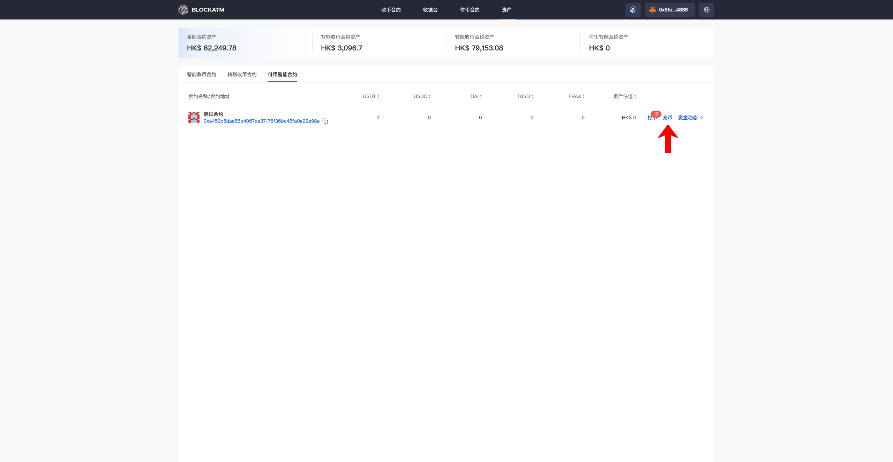
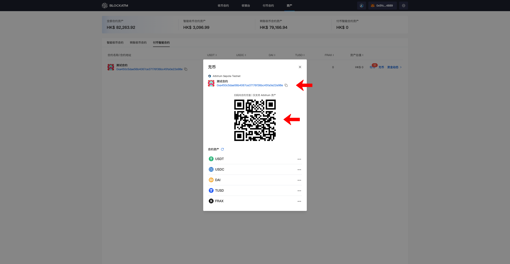
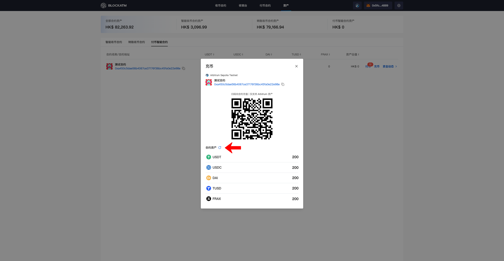

# Deposit

Batch Payout is done by using the Payout Contract to transfer the assets from the contract to specified wallet addresses in bulk. After creating the Payout Contract, you need to first deposit coins into the contract. Only when there are sufficient assets can the Payout be successfully processed.

First, connect the "Authorized Signer Address" wallet. The "Authorized Signer Address" can be found under the Asset Module -- Payout Contract. You will see the "Deposit" button. Click on "Deposit."

<figure><figcaption></figcaption></figure>

The Deposit popup will display the Payout Contract information and the asset quantities of each token. You can either scan the contract address QR code with your mobile wallet or copy the contract address to transfer funds into the Payout Contract.

<figure><figcaption></figcaption></figure>

After the transaction is completed, you can click the "Refresh" button to update the asset data.

<figure><figcaption></figcaption></figure>
