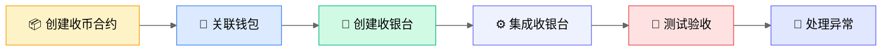

# 收币集成指南

本指南帮助您完成收币功能的完整集成，包括从创建合约到处理异常订单的完整流程。

## 集成流程概览



## 步骤 1：创建收币合约

1. 登录 BlockATM 管理后台
2. 进入「收币」→「收币合约」
3. 点击「创建合约」
4. 选择合约类型：
   - **Web3 收款合约**：用户通过钱包连接支付
   - **Scan2Pay 合约**：用户扫描二维码支付
5. 配置以下信息：
   - **签名地址**：有权从合约提取资金的地址
   - **收款地址**：资金最终到达的地址
6. 支付合约创建费用（200 USD）


**建议**：使用硬件钱包作为签名地址，确保资金安全。


## 步骤 2：关联 ERC20 和 TRC20 钱包

如果您的业务需要同时支持 ERC20 和 TRC20 网络，需要关联两种钱包。

### 关联步骤

1. 在顶部点击「网络」，切换到目标网络（如 TRON）
2. 选择钱包连接方式（TronLink、WalletConnect 等）
3. 点击连接后，弹出钱包关联确认框
4. 点击「关联」完成 ERC 和 TRC 网络的钱包关联


**示例**：假设您先在 ERC 网络创建了收币合约，然后切换到 TRC 网络。关联钱包后，创建收银台时可以同时绑定两个网络创建的合约。


## 步骤 3：创建收银台

1. 进入「收银台」页面，点击「创建」
2. 填写商户信息，选择收币网络和代币
3. 启用支付方式（连接钱包支付 / 扫码支付）
4. 绑定收币合约（一个合约只能绑定一个收银台）
5. 点击左下角「预览收银台」按钮预览效果
6. 确认后点击「确认」完成收银台创建

## 步骤 4：集成收银台

### 查看集成信息

点击收银台的「集成」按钮，查看：
- 收银台 ID
- API 密钥（公钥）
- Webhook Key
- Webhook 通知地址

### 集成收银台

本步骤介绍如何使用 Widget SDK 方式集成收银台。Widget SDK 集成简单快捷，无需后端参与签名。

**集成步骤**：

1. **引入 SDK**：在 HTML 页面中引入 BlockATM SDK 脚本

2. **添加容器**：在页面中添加收银台容器元素

3. **初始化 SDK**：调用 `window.BlockATM.init()` 初始化收银台

[查看 Widget SDK 集成详细文档 →](../widget-sdk/integration.md)

### 配置 Webhook（推荐）


**建议**：配置 Webhook 以接收支付结果通知。即使前端集成有任何问题或用户关闭浏览器，您也能通过 Webhook 可靠地获取支付结果。


**Webhook 配置步骤**：

1. 在「集成」页面填写 Webhook 通知地址
2. 获取 Webhook Key，用于验证接收到的通知签名
3. 在您的服务器上部署 Webhook 接收接口

[查看 Webhook 签名验证文档 →](../webhooks/verification.md)

### 集成测试

集成完成后，点击「测试收银台」进行测试验证。

用户支付的加密货币将发送到您的智能合约。一旦 BlockATM 检测到区块链上的成功交易，会向您配置的 Webhook 地址发送通知。

### 集成测试

集成完成后，点击「测试收银台」进行测试验证。

用户支付的加密货币将发送到您的智能合约。一旦 BlockATM 检测到区块链上的成功交易，会向您配置的 Webhook 地址发送通知。

## 步骤 5：处理异常订单


**前提**：只有收银台的操作员地址才能处理异常订单。操作员地址需要由 Owner 添加到收银台。


### 添加收银台操作员

1. 在收银台页面，点击「操作」按钮打开操作员弹窗
2. 点击「添加操作员」
3. 输入操作员的钱包地址和昵称
4. 点击「添加」完成操作员添加

### 操作员登录

操作员钱包连接 BlockATM DApp，只能看到相关的收银台。点击收银台中的「收币订单」进入订单页面。

### 订单丢失 — 手动完成订单

扫码支付方式的订单可能会遇到订单丢失（交易状态为处理中、已取消、已过期或失败）。如果订单丢失，操作员可以在 72 小时内手动完成订单。操作列中会出现「完成交易」按钮。

**手动完成步骤：**

1. 点击「完成交易」按钮，打开手动完成弹窗
2. 选择订单完成原因
3. 输入 TXID（区块链交易哈希）
4. 点击「确认」完成订单

### 通知异常 — 重发通知

如果您的业务系统未收到「已完成」或「已失败」状态的收币订单的 Webhook 通知，操作员可以在 72 内在操作列中点击「重发通知」按钮重新发送 Webhook 通知。

## 步骤 6：提币

收银台收到的加密货币存储在关联的收币合约中。从收币合约提取资产时，必须由合约指定的「签名地址」发起，发送到合约指定的「收款地址」。

### Web3 收币合约提币

1. 连接「签名地址」钱包（可在「资产」→「Web3 收币合约」中找到「提币」按钮）
2. 点击「提币」
3. 弹窗显示 Web3 收币合约中各代币的资产数量和提币手续费
4. 输入要提币的代币数量，选择「收款地址」
5. 点击「提币」，触发钱包签名授权交易
6. 等待区块链确认

### Scan2Pay 合约提币

1. 连接「签名地址」钱包（可在「资产」→「Scan2Pay 合约」中找到「提币」按钮）
2. 点击「提币」
3. 弹窗显示 Scan2Pay 合约中各代币的资产数量和提币手续费
4. 选择要提取的代币（默认提取全部数量），选择「收款地址」
5. 点击「提币」，触发钱包签名授权交易
6. 等待区块链确认

## 集成 Widget SDK

### 引入 SDK

```html
<script src="https://pay.blockatm.net/libs/v2/BlockATM.umd.js?apiKey=YOUR_API_KEY"></script>
```

### 初始化

```javascript
window.BlockATM.init(
  document.getElementById('blockatm-container'),
  {
    cashierId: 'YOUR_CASHIER_ID',
    signature: 'YOUR_SIGNATURE',
    orderNo: 'ORDER_' + Date.now(),
    amount: '100',
    symbol: 'USDT',
    chainId: 'TRON',
    callback: function(result) {
      if (result.type === 'finish') {
        // 支付成功
        console.log('Payment success:', result.data);
      }
    }
  }
);
```

[查看 Widget SDK 详细文档 →](../widget-sdk/README.md)

## 测试验收

| 测试场景 | 预期结果 |
|---------|---------|
| 正常支付 | 支付成功，收到 Webhook 通知 |
| 取消支付 | 订单状态变为已取消 |
| 订单过期 | 订单状态变为已过期 |
| 签名错误 | SDK 返回错误 |


**测试环境**：在测试环境完成后，再切换到生产环境。


## 下一步

- [查看 Widget SDK →](../widget-sdk/README.md)
- [查看 API 文档 →](../open-api/README.md)
- [查看常见问题 →](../../faq/collect.md)
