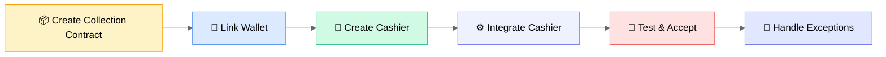

# Collection Integration Guide

This guide helps you complete the full integration of collection function, including from creating contracts to handling exception orders.

## Integration Flow Overview



## Step 1: Create Collection Contract

1. Login to BlockATM admin dashboard
2. Go to "Collection" → "Collection Contract"
3. Click "Create Contract"
4. Select contract type:
   - **Web3 Collection Contract**: User pays by connecting wallet
   - **Scan2Pay Contract**: User scans QR code to pay
5. Configure the following:
   - **Signer Address**: Address authorized to withdraw funds from contract
   - **Receiver Address**: Address where funds ultimately arrive
6. Pay contract creation fee (200 USD)


**Recommendation**: Use hardware wallet as signer address to ensure fund security.


## Step 2: Link ERC20 and TRC20 Wallets

If your business needs to support both ERC20 and TRC20 networks, you need to link both wallets.

### Linking Steps

1. Click "Network" at top to switch to target network (such as TRON)
2. Select wallet connection method (TronLink, WalletConnect, etc.)
3. After clicking connect, popup wallet linking confirmation
4. Click "Link" to complete linking wallets for ERC and TRC networks


**Example**: Suppose you first created collection contract on ERC network, then switched to TRC network. After linking wallet, you can bind contracts created on both networks when creating cashier.


## Step 3: Create Cashier

1. Go to "Cashier" page, click "Create"
2. Fill in merchant information, select collection network and token
3. Enable payment methods (wallet connect / scan payment)
4. Bind collection contract (one contract can only bind to one cashier)
5. Click "Preview Cashier" button at bottom left to preview
6. After confirmation, click "Confirm" to complete cashier creation

## Step 4: Integrate Cashier

### View Integration Information

Click "Integrate" button on cashier to view:
- Cashier ID
- API Key (public key)
- Webhook Key
- Webhook notification address

### Integrate Cashier

This step introduces how to integrate cashier using Widget SDK method. Widget SDK integration is simple and fast, no backend signature required.

**Integration Steps**:

1. **Import SDK**: Import BlockATM SDK script in HTML page

2. **Add Container**: Add cashier container element in page

3. **Initialize SDK**: Call `window.BlockATM.init()` to initialize cashier

[View Widget SDK Integration Detailed Documentation →](../widget-sdk/integration.md)

### Configure Webhook (Recommended)


**Recommendation**: Configure Webhook to receive payment result notifications. Even if there are any issues with frontend integration or user closes browser, you can reliably get payment results through Webhook.


**Webhook Configuration Steps**:

1. Fill Webhook notification address on "Integration" page
2. Get Webhook Key for verifying received notification signature
3. Deploy Webhook receiver interface on your server

[View Webhook Signature Verification Documentation →](../webhooks/verification.md)

### Integration Testing

After integration, click "Test Cashier" to conduct testing.

User's paid cryptocurrency will be sent to your smart contract. Once BlockATM detects successful transaction on blockchain, it will send notification to your configured Webhook address.

### Integration Testing

After integration, click "Test Cashier" to conduct testing.

User's paid cryptocurrency will be sent to your smart contract. Once BlockATM detects successful transaction on blockchain, it will send notification to your configured Webhook address.

## Step 5: Handle Exception Orders


**Prerequisite**: Only operator address of cashier can handle exception orders. Operator address needs to be added to cashier by Owner.


### Add Cashier Operator

1. On cashier page, click "Operation" button to open operator popup
2. Click "Add Operator"
3. Enter operator's wallet address and nickname
4. Click "Add" to complete operator addition

### Operator Login

Operator wallet connects to BlockATM DApp, can only see related cashiers. Click "Collection Orders" in cashier to go to order page.

### Order Lost — Manually Complete Order

Scan payment orders may encounter order lost (transaction status is processing, cancelled, expired or failed). If order is lost, operator can manually complete order within 72 hours. "Complete Transaction" button will appear in operation column.

**Manual Completion Steps**:

1. Click "Complete Transaction" button to open manual completion popup
2. Select order completion reason
3. Enter TXID (blockchain transaction hash)
4. Click "Confirm" to complete order

### Notification Exception — Resend Notification

If your business system did not receive Webhook notification for collection order with "Completed" or "Failed" status, operator can click "Resend Notification" button in operation column within 72 hours to resend Webhook notification.

## Step 6: Withdraw

Cryptocurrency received by cashier is stored in linked collection contract. When withdrawing assets from collection contract, it must be initiated by "Signer address" specified by contract, sent to "Receiver address" specified by contract.

### Web3 Collection Contract Withdraw

1. Connect "Signer Address" wallet (can find "Withdraw" button in "Assets" → "Web3 Collection Contract")
2. Click "Withdraw"
3. Popup shows asset quantity and withdraw fee for each token in Web3 collection contract
4. Enter token quantity to withdraw, select "Receiver Address"
5. Click "Withdraw", trigger wallet signature authorization transaction
6. Wait for blockchain confirmation

### Scan2Pay Contract Withdraw

1. Connect "Signer Address" wallet (can find "Withdraw" button in "Assets" → "Scan2Pay Contract")
2. Click "Withdraw"
3. Popup shows asset quantity and withdraw fee for each token in Scan2Pay contract
4. Select token to withdraw (default withdraw all quantity), select "Receiver Address"
5. Click "Withdraw", trigger wallet signature authorization transaction
6. Wait for blockchain confirmation

## Integrate Widget SDK

### Import SDK

```html
<script src="https://pay.blockatm.net/libs/v2/BlockATM.umd.js?apiKey=YOUR_API_KEY"></script>
```

### Initialize

```javascript
window.BlockATM.init(
  document.getElementById('blockatm-container'),
  {
    cashierId: 'YOUR_CASHIER_ID',
    signature: 'YOUR_SIGNATURE',
    orderNo: 'ORDER_' + Date.now(),
    amount: '100',
    symbol: 'USDT',
    chainId: 'TRON',
    callback: function(result) {
      if (result.type === 'finish') {
        // Payment successful
        console.log('Payment success:', result.data);
      }
    }
  }
);
```

[View Widget SDK Detailed Documentation →](../widget-sdk/README.md)

## Testing and Acceptance

| Test Scenario | Expected Result |
|---------|---------|
| Normal payment | Payment successful, Webhook notification received |
| Cancel payment | Order status changes to cancelled |
| Order expired | Order status changes to expired |
| Signature error | SDK returns error |


**Test Environment**: Complete in test environment first, then switch to production environment.


## Next Steps

- [View Widget SDK →](../widget-sdk/README.md)
- [View API Documentation →](../open-api/README.md)
- [View FAQ →](../../faq/collect.md)
