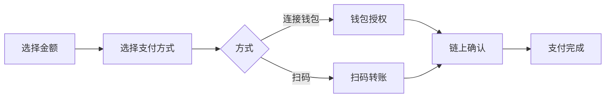

# 收币支付流程

本文档介绍用户完成加密货币支付的整体流程。

## 支付方式

BlockATM 提供两种收币方式：

| 支付方式 | 说明 | 适用场景 |
|---------|------|---------|
| **连接钱包** | 用户连接钱包直接授权支付 | 桌面浏览器 |
| **扫码支付** | 用户扫描二维码使用钱包支付 | 移动端 |

## 流程概览

## 连接钱包支付

1. **选择信息**：用户选择网络、货币类型，输入金额
2. **连接钱包**：选择 MetaMask/TronLink/WalletConnect 等
3. **确认支付**：确认金额后点击「立即支付」
4. **钱包授权**：首次需授权合约代扣
5. **链上确认**：等待区块链确认（3秒-3分钟）

## 扫码支付

1. **选择信息**：同连接钱包
2. **展示二维码**：收银台显示收款地址二维码
3. **扫码转账**：用户钱包 App 扫描并确认转账
4. **金额一致**：必须与显示金额完全一致
5. **链上确认**：等待确认

## 网络确认时间

| 网络 | 确认时间 |
|------|---------|
| TRON | ~3 秒 |
| Ethereum | ~15-30 秒 |
| Arbitrum | ~1-3 分钟 |

## 商户端处理

### Webhook 通知

支付完成后，BlockATM 自动发送 Webhook 通知到您配置的地址。

[配置 Webhook →](../webhooks/README.md)

### 订单状态

| 状态 | 说明 |
|------|------|
| 待支付 | 订单已创建 |
| 处理中 | 区块链已确认 |
| 已完成 | 支付成功 |
| 已取消 | 用户取消 |
| 已过期 | 超时未支付 |

## 常见问题

**Q：已付款但显示未支付？**

A：可能原因：
- 金额与订单不一致（扫码支付）
- 链上确认中（等待中）
- 网络问题

处理方式：商户可在管理后台手动完成订单或重发通知。

**Q：可以退款吗？**

A：BlockATM 不提供自动退款。需商户通过管理后台手动处理或使用付币功能退款。
