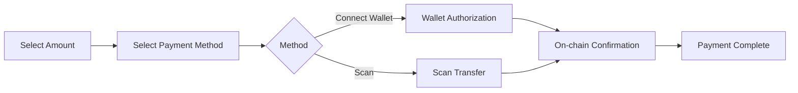

# Collection Payment Flow

This document describes the complete flow for users to complete cryptocurrency payment.

## Payment Methods

BlockATM provides two collection methods:

| Payment Method | Description | Applicable Scenario |
|---------|------|---------|
| **Wallet Connect** | User connects wallet and authorizes payment directly | Desktop browser |
| **Scan Payment** | User scans QR code to pay using wallet | Mobile |

## Flow Overview

## Wallet Connect Payment

1. **Select Info**: User selects network, currency type, enters amount
2. **Connect Wallet**: Select MetaMask/TronLink/WalletConnect, etc.
3. **Confirm Payment**: Confirm amount and click "Pay Now"
4. **Wallet Authorization**: First time may need to authorize contract deduction
5. **On-chain Confirmation**: Wait for blockchain confirmation (3 sec - 3 min)

## Scan Payment

1. **Select Info**: Same as wallet connect
2. **Display QR Code**: Cashier displays collection address QR code
3. **Scan Transfer**: User scans with wallet app and confirms transfer
4. **Amount Match**: Must match displayed amount exactly
5. **On-chain Confirmation**: Wait for confirmation

## Network Confirmation Time

| Network | Confirmation Time |
|------|---------|
| TRON | ~3 sec |
| Ethereum | ~15-30 sec |
| Arbitrum | ~1-3 min |

## Merchant Side Processing

### Webhook Notification

After payment completes, BlockATM automatically sends Webhook notification to your configured address.

[Configure Webhook →](../webhooks/README.md)

### Order Status

| Status | Description |
|------|------|
| Pending | Order created |
| Processing | Blockchain confirmed |
| Completed | Payment successful |
| Cancelled | User cancelled |
| Expired | Timeout, not paid |

## FAQ

**Q: Paid but shows unpaid?**

A: Possible causes:
- Amount doesn't match order (scan payment)
- On-chain confirmation pending
- Network issue

Solution: Merchant can manually complete order or resend notification in admin dashboard.

**Q: Can I issue refund?**

A: BlockATM does not provide automatic refund. Merchant handles manually through admin dashboard or uses payout function for refund.
