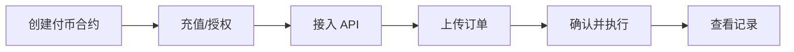

# 付币集成

本指南帮助您完成付币功能的完整集成，包括从创建合约到执行付币的完整流程。

## 集成流程概览



## 步骤 1：创建付币合约

1. 登录 BlockATM 管理后台
2. 进入「付币」→「付币合约」
3. 点击「创建合约」
4. 选择支付模式：
   * **余额模式**：资金预存到合约
   * **授权模式**：用户授权合约支配资金
5. 配置以下信息：
   * **打包地址**：执行付币交易的地址
   * **财务地址**：有权从合约提取资金的地址
6. 支付合约创建费用（200 USD）

[了解余额模式 →](../../products/batch-payout/balance-mode.md)

## 步骤 2：准备资金

### 余额模式：充值

向合约地址转入代币作为付币资金：

1. 在管理后台「资产」→「付币合约」中找到「充值」按钮
2. 获取合约地址（可扫描二维码或复制地址）
3. 从您的钱包向合约地址转账


**TRON 网络**：转账时无需额外 Gas，TRX 已包含在转账金额中。


### 授权模式：授权

1. 在管理后台「资产」→「付币合约」中获取合约地址
2. 在钱包中执行授权（授权合约地址支配您的代币）

```javascript
// 授权示例（使用合约 ABI）
const tokenContract = new web3.eth.Contract(ERC20_ABI, USDT_ADDRESS);
await tokenContract.methods.approve(
  CONTRACT_ADDRESS,
  web3.utils.toWei('10000', 'ether')
).send({ from: USER_ADDRESS });
```

## 步骤 3：接入 API

1. 在管理后台「付币合约」中找到接入的合约
2. 点击「应用」按钮
3. 点击「创建订单」，在弹出下拉中选择「」pi&#x20;

### 创建付币订单

**API 方式上传：**

```json
POST /order/api/v2/payout/order
{
  "contractId": "CONTRACT_ID",
  "orderNo": "PAYOUT_001",
  "recipient": "0x...",  // 收款地址
  "amount": "100",
  "symbol": "USDT",
  "payoutType": 1,  // 1=余额, 2=授权
  "sign": "..."
}
```

**Excel 方式上传：**

1. 在付币弹窗中切换到「Excel」标签
2. 点击「下载订单模板」
3. 按照规则填写订单信息（网络、代币、金额等）
4. 点击「上传订单」上传 Excel 文件
5. 检查上传结果（超额度会标红提示）
6. 确认无误后点击「提交付币请求」

[查看付币 API 详细文档 →](../open-api/payout-api.md)

## 步骤 4：确认并执行付币

### API 订单执行

1. 连接「签名地址」钱包（可在「资产」→「付币合约」中找到「付币」按钮）
2. 点击「付币」，打开付币弹窗（默认显示 API 上传的订单）
3. 点击列表展开，查看各代币的付币订单详情
4. 仔细核对订单信息，如发现异常可选择「拒绝付款」或取消勾选
5. 如选择拒绝付款，将触发钱包签名确认
6. 确认订单后点击「提交付币请求」，触发钱包签名确认


**重要**：确保「签名地址」是执行操作的地址。


### 自动提交

为消除「签名地址」人工审核的需求，可以开启自动提交功能。当订单上传后，如果「签名地址」在一定时间内未审核，系统将自动审核并提交订单。

## 步骤 5：查看付币记录

提交后，点击「付币记录」查看付币订单状态（也可在「资产」→「付币合约」→「资金动态」→「付币记录」中查看）。

刚提交的付币订单状态为「待付款」，将在 24 小时内完成支付。

### 订单状态说明

| 状态  | 说明   |
| --- | ---- |
| 待付款 | 等待执行 |
| 处理中 | 执行中  |
| 已完成 | 付币成功 |
| 已失败 | 付币失败 |

## 余额支付 vs 授权支付

### 余额支付模式

```json
{
  "contractId": "CONTRACT_ID",
  "orderNo": "PAYOUT_001",
  "recipient": "0x...",
  "amount": "100",
  "symbol": "USDT",
  "payoutType": 1
}
```

### 授权支付模式

```json
{
  "contractId": "CONTRACT_ID",
  "orderNo": "PAYOUT_001",
  "recipient": "0x...",
  "amount": "100",
  "symbol": "USDT",
  "payoutType": 2,
  "fromAddress": "0x..."  // 授权地址
}
```

## 授权付币注意事项


**授权付币要点**：

1. 授权地址不再限于单一地址，可使用任意授权地址
2. 不再强制要求白名单（授权支付方式）
3. 支付方式二选一，不支持混合
4. 前端需实时查询链上授权额度


## 测试验收

| 测试场景 | 预期结果            |
| ---- | --------------- |
| 正常付币 | 付币成功，收到 Webhook |
| 余额不足 | 返回余额不足错误        |
| 授权不足 | 返回授权额度不足错误      |
| 签名错误 | 返回签名验证失败        |


**测试环境**：所有测试使用测试网代币，没有实际价值。


## 下一步

* [查看 API 文档 →](../open-api/)
* [查看常见问题 →](../../faq/payout.md)
