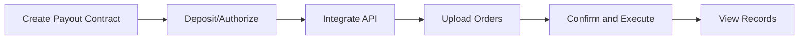

# Payout Integration Guide

This guide helps you complete the full integration of payout function, including from creating contracts to executing payouts.

## Integration Flow Overview



## Step 1: Create Payout Contract

1. Login to BlockATM admin dashboard
2. Go to "Payout" → "Payout Contract"
3. Click "Create Contract"
4. Select payment mode:
   - **Balance Mode**: Funds pre-deposited to contract
   - **Allowance Mode (V5.8.0)**: User authorizes contract to spend funds
5. Configure the following:
   - **Packer Address**: Address that executes payout transactions
   - **Finance Address**: Address authorized to withdraw funds from contract
6. Pay contract creation fee (200 USD)

[Learn Balance Mode →](../../products/batch-payout/balance-mode.md)

[Learn Allowance Mode →](../../products/batch-payout/allowance-mode.md)

## Step 2: Prepare Funds

### Balance Mode: Deposit

Transfer tokens to contract address as payout funds:

1. Find "Deposit" button in admin dashboard "Assets" → "Payout Contract"
2. Get contract address (can scan QR code or copy address)
3. Transfer from your wallet to contract address


**TRON Network**: No additional Gas needed for transfer, TRX is included in transfer amount.


### Allowance Mode: Authorize

1. Get contract address in admin dashboard "Assets" → "Payout Contract"
2. Execute authorization in wallet (authorize contract address to spend your tokens)

```javascript
// Authorization example (using contract ABI)
const tokenContract = new web3.eth.Contract(ERC20_ABI, USDT_ADDRESS);
await tokenContract.methods.approve(
  CONTRACT_ADDRESS,
  web3.utils.toWei('10000', 'ether')
).send({ from: USER_ADDRESS });
```

## Step 3: Integrate API

### Create Payout Order

**API Upload**:
```json
POST /order/api/v2/payout/order
{
  "contractId": "CONTRACT_ID",
  "orderNo": "PAYOUT_001",
  "recipient": "0x...",  // Recipient address
  "amount": "100",
  "symbol": "USDT",
  "payoutType": 1,  // 1=balance, 2=allowance
  "sign": "..."
}
```

**Excel Upload**:
1. Switch to "Excel" tab in payout popup
2. Click "Download Order Template"
3. Fill order information according to rules (network, token, amount, etc.)
4. Click "Upload Orders" to upload Excel file
5. Check upload results (over limit will be marked in red)
6. After confirming no issues, click "Submit Payout Request"

[View Payout API Detailed Documentation →](../open-api/payout-api.md)

## Step 4: Confirm and Execute Payout

### API Order Execution

1. Connect "Signer Address" wallet (can find "Payout" button in "Assets" → "Payout Contract")
2. Click "Payout" to open payout popup (default shows API uploaded orders)
3. Click list to expand and view payout order details for each token
4. Carefully check order information. If anomaly found, can select "Reject Payment" or uncheck
5. If rejecting payment, will trigger wallet signature confirmation
6. After confirming order, click "Submit Payout Request", trigger wallet signature confirmation


**Important**: Ensure "Signer Address" is the address executing the operation.


### Auto Submit

To eliminate need for "Signer Address" manual review, can enable auto submit. When orders are uploaded, if "Signer Address" doesn't review within certain time, system will automatically review and submit orders.

## Step 5: View Payout Records

After submission, click "Payout Records" to view payout order status (can also view in "Assets" → "Payout Contract" → "Fund Activity" → "Payout Records").

Newly submitted payout order status is "Pending Payment", will complete within 24 hours.

### Order Status Description

| Status | Description |
|------|------|
| Pending Payment | Waiting to execute |
| Processing | Executing |
| Completed | Payout successful |
| Failed | Payout failed |

## Balance Payment vs Authorization Payment

### Balance Payment Mode

```json
{
  "contractId": "CONTRACT_ID",
  "orderNo": "PAYOUT_001",
  "recipient": "0x...",
  "amount": "100",
  "symbol": "USDT",
  "payoutType": 1
}
```

### Authorization Payment Mode

```json
{
  "contractId": "CONTRACT_ID",
  "orderNo": "PAYOUT_001",
  "recipient": "0x...",
  "amount": "100",
  "symbol": "USDT",
  "payoutType": 2,
  "fromAddress": "0x..."  // Authorization address
}
```

## V5.8.0 Allowance Payout Notes


**V5.8.0 Allowance Payout Key Points**:

1. Authorization address is no longer limited to single address, can use any authorization address
2. Whitelist no longer mandatory (for allowance payment method)
3. Choose one of two payment methods, mixed not supported
4. Frontend needs to query on-chain authorization amount in real-time


## Testing and Acceptance

| Test Scenario | Expected Result |
|---------|---------|
| Normal payout | Payout successful, Webhook received |
| Insufficient balance | Returns insufficient balance error |
| Insufficient authorization | Returns insufficient authorization error |
| Signature error | Returns signature verification failure |


**Test Environment**: All tests use testnet tokens, no actual value.


## Next Steps

- [View API Documentation →](../open-api/README.md)
- [View FAQ →](../../faq/payout.md)
