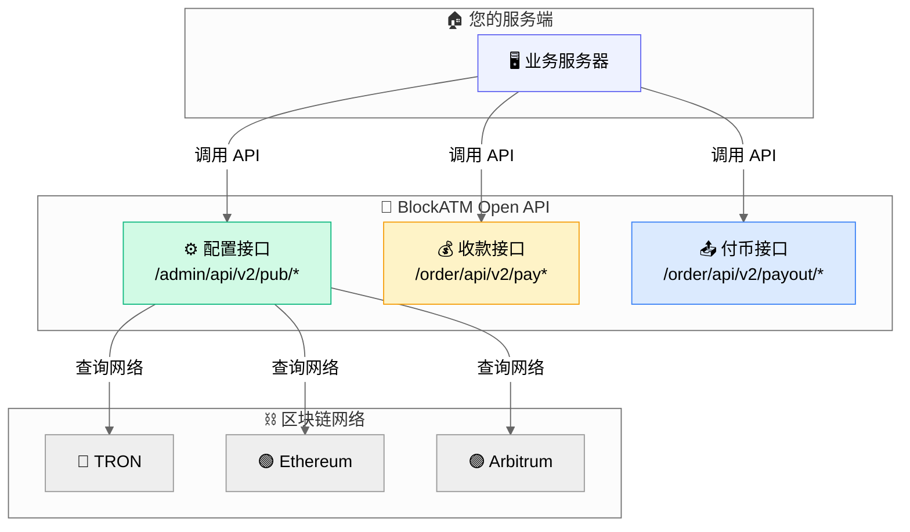

# Open API

BlockATM Open API 提供完整的支付接口，支持收币、付币、订单查询等功能。

## 特点

- ✅ **功能完整**：覆盖收币、付币、配置、查询全部场景
- ✅ **签名安全**：HMAC-SHA256 请求签名
- ✅ **Webhook 支持**：实时接收支付事件通知

## API 架构

## API 环境

| 环境 | Base URL |
|------|----------|
| 生产环境 | `https://open.blockatm.net` |
| 测试环境 | `https://test-open.blockatm.net` |

## 接口分类

### 配置接口

| 接口 | 方法 | 说明 |
|------|------|------|
| `GET /admin/api/v2/pub/allNetworks` | 获取支持的网络列表 |
| `GET /admin/api/v2/pub/cashier/info` | 获取收银台配置信息 |

### 收款接口

| 接口 | 方法 | 说明 |
|------|------|------|
| `GET /order/api/v2/payorder/list` | 查询收款订单列表 |
| `GET /order/api/v2/payorder/detail` | 查询收款订单详情 |

### 付币接口

| 接口 | 方法 | 说明 |
|------|------|------|
| `POST /order/api/v2/payout/order` | 创建付币订单（需签名） |
| `GET /order/api/v2/payout/detail` | 查询付币订单详情 |

## 快速开始

1. [了解签名认证 →](authentication.md)
2. [查看请求格式 →](request-format.md)
3. [查看收款 API →](payment-api.md)
4. [查看付币 API →](payout-api.md)

## 费用说明

| 服务 | 费用 |
|------|------|
| 创建收币订单 | 免费 |
| 创建付币订单 | 免费 |
| 收币成功 | 2 USD 或 0.4% |
| 付币成功 | 1 USD |
