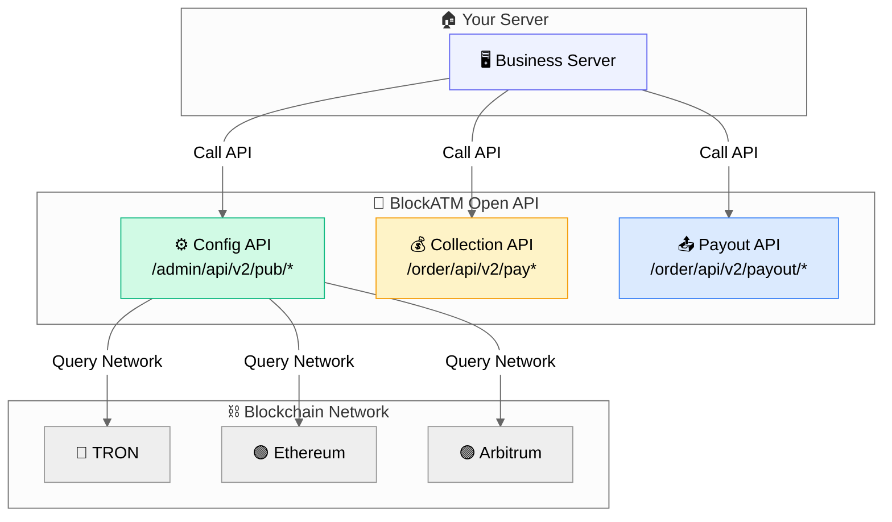

# Open API

BlockATM Open API provides complete payment interfaces, supporting collection, payout, order queries and more.

## Features

- ✅ **Complete Functions**: Covers collection, payout, configuration, and all query scenarios
- ✅ **Secure Signing**: HMAC-SHA256 request signature
- ✅ **Webhook Support**: Real-time payment event notifications

## API Architecture

## API Environment

| Environment | Base URL |
|------|----------|
| Production | `https://open.blockatm.net` |
| Test | `https://test-open.blockatm.net` |

## API Categories

### Config APIs

| API | Method | Description |
|------|------|------|
| `GET /admin/api/v2/pub/allNetworks` | Get supported network list |
| `GET /admin/api/v2/pub/cashier/info` | Get cashier configuration info |

### Collection APIs

| API | Method | Description |
|------|------|------|
| `GET /order/api/v2/payorder/list` | Query collection order list |
| `GET /order/api/v2/payorder/detail` | Query collection order details |

### Payout APIs

| API | Method | Description |
|------|------|------|
| `POST /order/api/v2/payout/order` | Create payout order (requires signature) |
| `GET /order/api/v2/payout/detail` | Query payout order details |

## Quick Start

1. [Learn about signature authentication →](authentication.md)
2. [View request format →](request-format.md)
3. [View collection API →](payment-api.md)
4. [View payout API →](payout-api.md)

## Fee Description

| Service | Fee |
|------|------|
| Create collection order | Free |
| Create payout order | Free |
| Collection success | 2 USD or 0.4% |
| Payout success | 1 USD |
