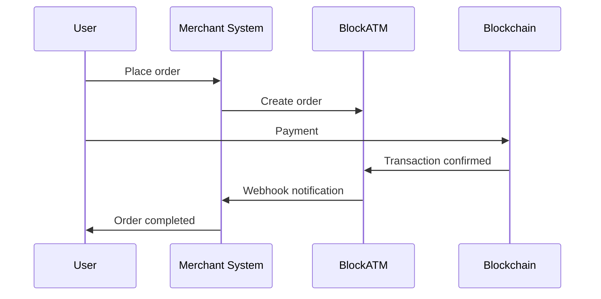

# Overview

Webhooks are used to notify your server in real-time when payment events occur.

## Overview

When order status changes (e.g., user payment successful), BlockATM sends HTTP POST request to your configured Webhook URL to notify you for processing.


**Use Cases**: Webhooks are suitable for backend order processing, automated inventory updates, user notifications, etc. Even if the frontend page is closed, your server can still receive notifications.


## How It Works



## Configuration

1. Login to BlockATM admin dashboard
2. Go to "Cashier" → "Integration"
3. Configure Webhook notification URL
4. Get Webhook Key (for signature verification)

## Request Specification

### Request Headers

| Header | Description | Example |
| --------------------- | -------------- | ---------------- |
| Content-Type | Content type | application/json |
| BlockATM-Signature-V2 | HMAC-SHA256 signature | c3109d97... |
| BlockATM-Request-Time | Unix timestamp (milliseconds) | 1743060268000 |
| BlockATM-Event | Event type | payment / payout |

### Request Format

```http
POST /your-endpoint HTTP/1.1
Host: your-server.com
Content-Type: application/json
BlockATM-Signature-V2: ab3d...
BlockATM-Request-Time: 1743060268000
BlockATM-Event: Payment

{
  "custNo": "evt_123456789",
  "orderNo": "ORD202312345",
  "status": "SUCCESS",
  ...
}
```

## Event Types

| Event | Description | Documentation |
| ------- | -------- | ---------------------------- |
| payment | Collection order status change | [View details →](payment-webhook.md) |
| payout | Payout order status change | [View details →](payout-webhook.md) |

## Response Handling

```python
from flask import Flask, request

app = Flask(__name__)

@app.route('/webhook', methods=['POST'])
def handle_webhook():
    signature = request.headers.get('BlockATM-Signature-V2')
    timestamp = request.headers.get('BlockATM-Request-Time')
    event_type = request.headers.get('BlockATM-Event')

    # Verify request
    if not verify_request(signature, timestamp, request.data):
        return "Invalid request", 401

    # Handle event
    if event_type == 'payment':
        handle_payment(request.json)
    elif event_type == 'payout':
        handle_payout(request.json)

    return "OK", 200
```

## Important Notes


#### Security and Reliability Requirements

1. **Use HTTPS**: Ensure your Webhook URL uses HTTPS protocol
2. **Return HTTP 200**: Server must return HTTP 200 to confirm receipt
3. **Idempotent Processing**: The same event may be received multiple times, ensure processing logic is idempotent
4. **Retry Mechanism**: If delivery fails, BlockATM will retry 5 times within 24 hours


## Next Steps

* [View collection events →](payment-webhook.md)
* [View payout events →](payout-webhook.md)
* [View signature verification →](verification.md)
