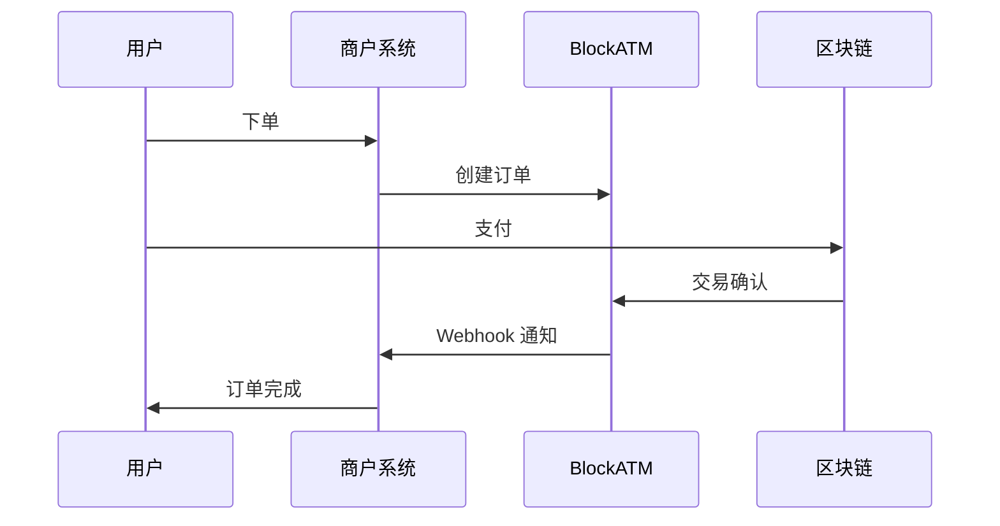

# 概述

Webhook 用于在支付事件发生时，实时通知您的服务器。

## 概述

当订单状态发生变化时（如用户支付成功），BlockATM 会向您配置的 Webhook URL 发送 HTTP POST 请求，通知您处理。


**使用场景**：Webhook 适用于后台订单处理、自动化库存更新、用户通知等场景。即使前端页面关闭，您的服务器也能收到通知。


## 工作原理



## 配置方式

1. 登录 BlockATM 管理后台
2. 进入「收银台」→「集成」
3. 配置 Webhook 通知地址
4. 获取 Webhook Key（用于签名验证）

## 请求规格

### 请求头

| Header                | 说明             | 示例               |
| --------------------- | -------------- | ---------------- |
| Content-Type          | 内容类型           | application/json |
| BlockATM-Signature-V2 | HMAC-SHA256 签名 | c3109d97...      |
| BlockATM-Request-Time | Unix 时间戳（毫秒）   | 1743060268000    |
| BlockATM-Event        | 事件类型           | payment / payout |

### 请求格式

```http
POST /your-endpoint HTTP/1.1
Host: your-server.com
Content-Type: application/json
BlockATM-Signature-V2: ab3d...
BlockATM-Request-Time: 1743060268000
BlockATM-Event: Payment

{
  "custNo": "evt_123456789",
  "orderNo": "ORD202312345",
  "status": "SUCCESS",
  ...
}
```

## 事件类型

| 事件      | 说明       | 详细文档                         |
| ------- | -------- | ---------------------------- |
| payment | 收币订单状态变更 | [查看详情 →](payment-webhook.md) |
| payout  | 付币订单状态变更 | [查看详情 →](payout-webhook.md)  |

## 响应处理

```python
from flask import Flask, request

app = Flask(__name__)

@app.route('/webhook', methods=['POST'])
def handle_webhook():
    signature = request.headers.get('BlockATM-Signature-V2')
    timestamp = request.headers.get('BlockATM-Request-Time')
    event_type = request.headers.get('BlockATM-Event')
    
    # 验证请求
    if not verify_request(signature, timestamp, request.data):
        return "Invalid request", 401
    
    # 处理事件
    if event_type == 'payment':
        handle_payment(request.json)
    elif event_type == 'payout':
        handle_payout(request.json)
        
    return "OK", 200
```

## 重要注意事项


#### 安全与可靠性要求

1. **使用 HTTPS**：确保您的 Webhook URL 使用 HTTPS 协议
2. **返回 HTTP 200**：服务器必须返回 HTTP 200 确认收到请求
3. **幂等处理**：同一事件可能收到多次通知，请确保处理逻辑幂等
4. **重试机制**：如果投递失败，BlockATM 会在 24 小时内重试 5 次


## 下一步

* [查看收币事件 →](payment-webhook.md)
* [查看付币事件 →](payout-webhook.md)
* [查看签名验证 →](verification.md)
