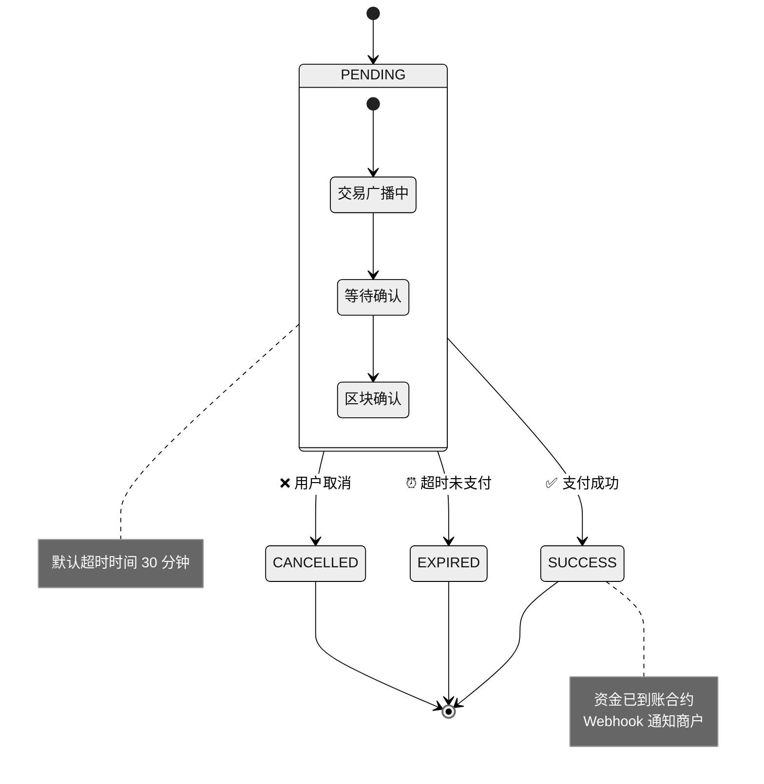

# 收币事件 (payment)

当收币订单状态发生变化时，BlockATM 会通过 Webhook 向您发送通知。例如用户完成支付、订单超时或用户取消时，都会触发相应的事件通知。

## 事件状态

| 状态名 | 说明 | 触发场景 |
|--------|------|----------|
| **PENDING** | 订单已到达区块链确认数 | 用户的交易已被区块链确认，等待最终处理 |
| **SUCCESS** | 支付已确认成功 | 用户完成支付，金额已到账 |
| **EXPIRED** | 订单超时未完成支付 | 用户未在规定时间内完成支付 |
| **CANCELLED** | 用户取消支付 | 用户主动取消了支付流程 |

## 事件负载示例

```json
{
  "custNo": "CustNo_00240101",
  "orderNo": "OrderNo_202504010023",
  "id": 8210003616,
  "symbol": "USDT",
  "amount": "2000.00",
  "status": "SUCCESS",
  "txId": "0x7614a9840d9422feaef4671e0ee98dd7092ebcba6e41076285f99d0b2b0de5fe",
  "network": "Ethereum",
  "chainId": "1",
  "fromAddress": "0xa9e358e33a57e67c9b84618a52f0194c345c8e35",
  "cashierId": 86100021
}
```

## 字段说明

| 字段名 | 类型 | 说明 | 示例 |
|--------|------|------|------|
| id | Long | BlockATM 平台订单号，这是您在 BlockATM 平台查询订单的唯一标识符 | 8210000374 |
| orderNo | String | 商户侧订单号，由商户在创建订单时传入，用于关联商户自己的订单系统 | O20231022 |
| chainId | String | 区块链网络的唯一标识符，可通过 [chainlist.org](https://chainlist.org/) 查询各网络的 ChainId | 1（Ethereum）、42161（Arbitrum） |
| cashierId | Integer | 收银台 ID，用于标识是哪个收银台收到的支付 | 199 |
| amount | String | 用户实际支付的金额，用户在收银台选择的支付金额 | 13.410037 |
| custNo | String | 商户侧用户编号，用于标识是哪个用户进行的支付，方便商户关联其用户体系 | 860021 |
| network | String | 网络名称，用于描述本次交易订单发生的网络。建议使用 chainId 唯一标识对应的链 | Ethereum, TRON, Arbitrum |
| symbol | String | 用户支付的代币标识符，如 USDT、USDC 等 | USDT |
| txId | String | 区块链上的交易哈希，您可以在对应的区块浏览器上查看交易详情 | 0x7614a9840d9422feaef4671e0ee98dd7092ebcba6e41076285f99d0b2b0de5fe |
| orderType | Integer | 订单类型，1 表示智能合约支付（钱包连接方式），2 表示二维码支付（扫码方式），3 表示合约地址直接转账 | 1 |
| status | String | 订单状态，PENDING 表示待处理，SUCCESS 表示成功，EXPIRED 表示已过期，CANCELLED 表示已取消 | SUCCESS |
| fromAddress | String | 支付用户的钱包地址，如果用户尚未支付则为空字符串 | 0xa9e358E33a57E67c9B84618a52f0194C345C8e35 |
| blockTime | Long | 订单在区块链上的时间戳（毫秒），表示交易被区块链记录的时间 | 1693212861016 |

## 订单状态流转



## 处理建议


**开发建议**：

1. **状态判断**：建议以 `status` 字段的值判断订单状态，而非 `id` 或其他字段
2. **幂等处理**：同一个订单可能会收到多次 Webhook 通知（如网络重试），请确保处理逻辑幂等
3. **时间验证**：使用 `blockTime` 验证订单时间，便于排查问题和做对账处理
4. **交易验证**：可以使用 `txId` 在区块链浏览器上验证交易的真伪和详情


## 下一步

- [查看付币事件 →](payout-webhook.md)
- [查看签名验证 →](verification.md)
