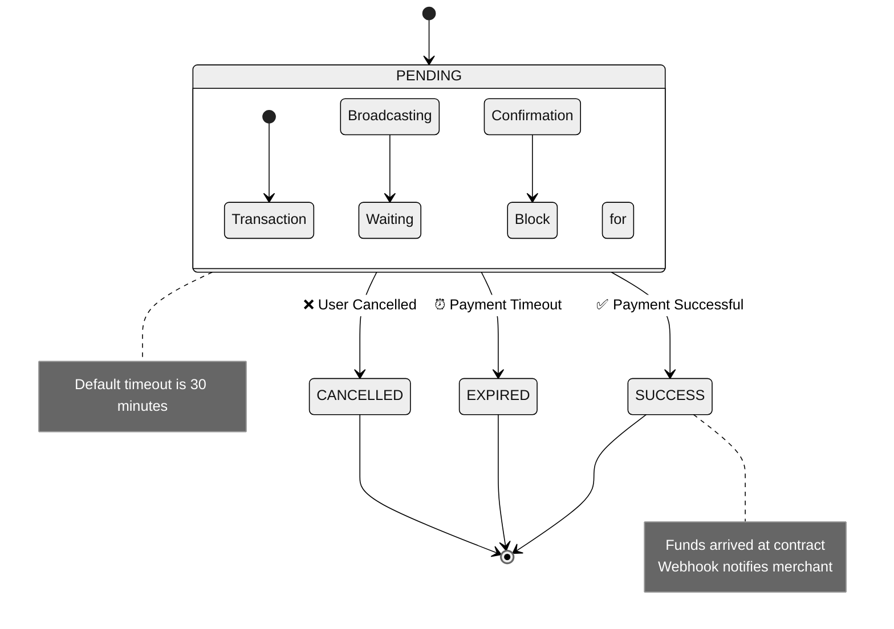

# Collection Events (payment)

When collection order status changes, BlockATM sends notifications via Webhook. For example, when user completes payment, order times out, or user cancels, corresponding event notifications will be triggered.

## Event Status

| Status | Description | Trigger Scenario |
|--------|------|----------|
| **PENDING** | Order reached blockchain confirmation | User transaction confirmed on blockchain, waiting for final processing |
| **SUCCESS** | Payment confirmed successful | User completed payment, amount received |
| **EXPIRED** | Order timed out without completing payment | User did not complete payment within specified time |
| **CANCELLED** | User cancelled payment | User actively cancelled payment process |

## Event Payload Example

```json
{
  "custNo": "CustNo_00240101",
  "orderNo": "OrderNo_202504010023",
  "id": 8210003616,
  "symbol": "USDT",
  "amount": "2000.00",
  "status": "SUCCESS",
  "txId": "0x7614a9840d9422feaef4671e0ee98dd7092ebcba6e41076285f99d0b2b0de5fe",
  "network": "Ethereum",
  "chainId": "1",
  "fromAddress": "0xa9e358e33a57e67c9b84618a52f0194c345c8e35",
  "cashierId": 86100021
}
```

## Field Description

| Field | Type | Description | Example |
|--------|------|------|------|
| id | Long | BlockATM platform order number, unique identifier for querying orders on BlockATM platform | 8210000374 |
| orderNo | String | Merchant order number, passed by merchant when creating order, used to associate with merchant's own order system | O20231022 |
| chainId | String | Unique identifier of blockchain network, can query ChainId of each network via [chainlist.org](https://chainlist.org/) | 1 (Ethereum), 42161 (Arbitrum) |
| cashierId | Integer | Cashier ID, used to identify which cashier received the payment | 199 |
| amount | String | Actual amount paid by user, payment amount selected by user on cashier | 13.410037 |
| custNo | String | Merchant's user ID, used to identify which user made the payment, convenient for merchant to associate with their user system | 860021 |
| network | String | Network name, used to describe the network where this transaction occurred. Recommend using chainId to uniquely identify the chain | Ethereum, TRON, Arbitrum |
| symbol | String | Token identifier paid by user, such as USDT, USDC, etc. | USDT |
| txId | String | Transaction hash on blockchain, you can view transaction details on the corresponding block explorer | 0x7614a9840d9422feaef4671e0ee98dd7092ebcba6e41076285f99d0b2b0de5fe |
| orderType | Integer | Order type, 1 means smart contract payment (wallet connect), 2 means QR code payment (scan), 3 means contract address direct transfer | 1 |
| status | String | Order status, PENDING means pending, SUCCESS means success, EXPIRED means expired, CANCELLED means cancelled | SUCCESS |
| fromAddress | String | User's wallet address, empty string if user has not paid yet | 0xa9e358E33a57E67c9B84618a52f0194C345C8e35 |
| blockTime | Long | Timestamp (milliseconds) of order on blockchain, time when transaction was recorded on blockchain | 1693212861016 |

## Order Status Flow



## Handling Suggestions


**Development Suggestions**:

1. **Status Judgment**: Recommend judging order status by `status` field value, not `id` or other fields
2. **Idempotent Processing**: The same order may receive multiple Webhook notifications (e.g., network retry), ensure processing logic is idempotent
3. **Time Verification**: Use `blockTime` to verify order time, convenient for troubleshooting and reconciliation
4. **Transaction Verification**: Can use `txId` to verify authenticity and details of transaction on blockchain explorer


## Next Steps

- [View payout events →](payout-webhook.md)
- [View signature verification →](verification.md)
