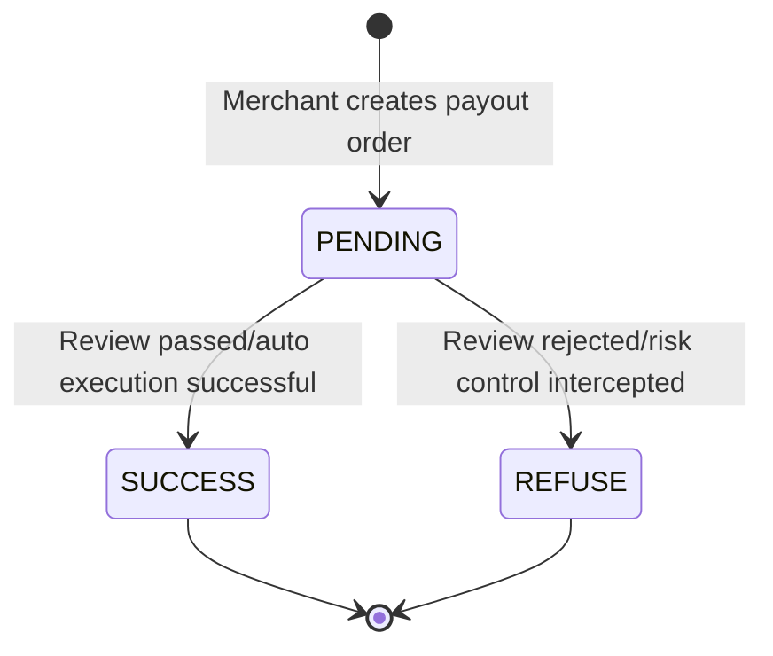

# Payout Events (payout)

When payout order status changes, BlockATM sends notifications via Webhook. For example, when payout is successful or refused, corresponding event notifications will be triggered.

## Event Status

| Status | Description | Trigger Scenario |
|--------|------|----------|
| **SUCCESS** | Payout successful | Blockchain confirmed, funds arrived at target address |
| **REFUSE** | Payout refused | Review not passed or risk control intercepted |

## Event Payload Example

```json
{
  "custNo": "CustNo_2022140101",
  "bizOrderNo": "B202505220012",
  "id": 8210003616,
  "symbol": "USDT",
  "amount": "2000.00",
  "status": "SUCCESS",
  "txId": "0x7614a9840d9422feaef4671e0ee98dd7092ebcba6e41076285f99d0b2b0de5fe",
  "network": "Ethereum",
  "chainId": "1",
  "fromAddress": "0xa9e358e33a57e67c9b84618a52f0194c345c8e35",
  "toAddress": "0xa9e358E33a57E67c9B84618a52f0194C345C8e35",
  "fee": "2",
  "gasAmount": "1",
  "type": 1,
  "createTime": 1693212861016,
  "contractId": 200910,
  "blockTime": 1693212861016
}
```

## Field Description

| Field | Type | Description | Example |
|--------|------|------|------|
| bizOrderNo | String | Merchant order number, passed by merchant when creating payout order, used to associate with merchant's own order system | B202505220012 |
| amount | String | Payout amount, i.e., amount you want to pay to target address | 13.410037 |
| chainId | String | Unique identifier of blockchain network, can query ChainId of each network via [chainlist.org](https://chainlist.org/) | 1 (Ethereum), 42161 (Arbitrum) |
| custNo | String | Merchant's user ID, used to identify which user this payout is for | 860021 |
| fee | String | Order handling fee, unit is USDT. This is the service fee charged by BlockATM | 2 |
| gasAmount | String | Actual Gas consumption, unit is USDT. This is the actual fee consumed on blockchain network | 1 |
| toAddress | String | Target address, i.e., wallet address where assets will be transferred. Please confirm address correctness | 0xa9e358E33a57E67c9B84618a52f0194C345C8e35 |
| network | String | Network name, used to describe the network where this transaction occurred. Recommend using chainId to uniquely identify the chain | Ethereum, TRON, Arbitrum |
| symbol | String | Token identifier, such as USDT, USDC, etc. | USDT |
| txId | String | Transaction hash on blockchain, you can view transaction details on the corresponding block explorer | 0x7614a9840d9422feaef4671e0ee98dd7092ebcba6e41076285f99d0b2b0de5fe |
| type | Integer | Order type, 1 means smart contract payment (wallet connect), 2 means QR code payment (scan), 3 means contract address direct transfer | 1 |
| status | String | Order status, SUCCESS means success, REFUSE means refused | SUCCESS |
| createTime | Long | Order creation time (milliseconds), time when user created payout order in merchant system | 1693212861016 |
| contractId | Integer | Payout contract ID, unique identifier of the payout contract you created in BlockATM | 200910 |
| blockTime | Long | Blockchain timestamp (milliseconds), time when transaction was recorded on blockchain | 1693212861016 |

## Order Status Flow



## Fee Description

Payout orders involve two types of fees:

1. **Service Fee (fee)**: Platform service fee charged by BlockATM, fixed 1 USDT/order
2. **Gas Fee (gasAmount)**: Actual fee consumed on blockchain network, may vary depending on network congestion

Both fees will be deducted from your contract balance, and will not affect the amount you pay to users.

## Handling Suggestions


**Development Suggestions**:

1. **Status Judgment**: Recommend judging payout result by `status` field value, SUCCESS means success, REFUSE means failed
2. **Reconciliation**: Use `amount`, `fee`, `gasAmount` for reconciliation, ensure fee deduction matches expectation
3. **User Notification**: Use `custNo` to find corresponding user, timely send payment result notification
4. **Transaction Verification**: Can use `txId` to verify authenticity and details of transaction on blockchain explorer
5. **Failure Handling**: When receiving REFUSE status, should check contract balance or risk control rules, and can resubmit payout


## Next Steps

- [View collection events →](payment-webhook.md)
- [View signature verification →](verification.md)
