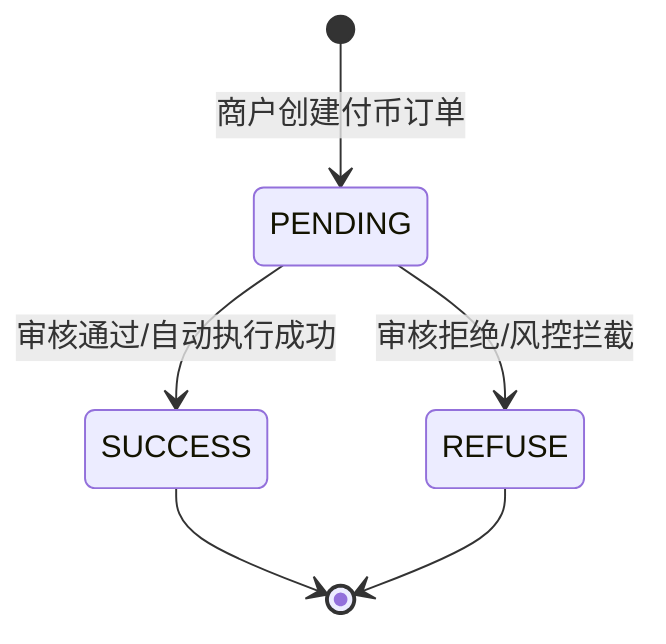

# 付币事件 (payout)

当付币订单状态发生变化时，BlockATM 会通过 Webhook 向您发送通知。例如付币成功或被拒绝时，都会触发相应的事件通知。

## 事件状态

| 状态名 | 说明 | 触发场景 |
|--------|------|----------|
| **SUCCESS** | 付币成功 | 区块链确认完成，款项已到达目标地址 |
| **REFUSE** | 付币被拒绝 | 审核未通过或风控拦截 |

## 事件负载示例

```json
{
  "custNo": "CustNo_2022140101",
  "bizOrderNo": "B202505220012",
  "id": 8210003616,
  "symbol": "USDT",
  "amount": "2000.00",
  "status": "SUCCESS",
  "txId": "0x7614a9840d9422feaef4671e0ee98dd7092ebcba6e41076285f99d0b2b0de5fe",
  "network": "Ethereum",
  "chainId": "1",
  "fromAddress": "0xa9e358e33a57e67c9b84618a52f0194c345c8e35",
  "toAddress": "0xa9e358E33a57E67c9B84618a52f0194C345C8e35",
  "fee": "2",
  "gasAmount": "1",
  "type": 1,
  "createTime": 1693212861016,
  "contractId": 200910,
  "blockTime": 1693212861016
}
```

## 字段说明

| 字段名 | 类型 | 说明 | 示例 |
|--------|------|------|------|
| bizOrderNo | String | 商户侧订单号，由商户在创建付币订单时传入，用于关联商户自己的订单系统 | B202505220012 |
| amount | String | 付币金额，即您要支付给目标地址的金额 | 13.410037 |
| chainId | String | 区块链网络的唯一标识符，可通过 [chainlist.org](https://chainlist.org/) 查询各网络的 ChainId | 1（Ethereum）、42161（Arbitrum） |
| custNo | String | 商户侧用户编号，用于标识这笔付币是给哪个用户的 | 860021 |
| fee | String | 订单手续费，单位是 USDT。这是 BlockATM 收取的服务费用 | 2 |
| gasAmount | String | 实际 Gas 消耗，单位是 USDT。这是区块链网络上实际消耗的手续费 | 1 |
| toAddress | String | 目标地址，即资产要转入的钱包地址，请务必确认地址正确性 | 0xa9e358E33a57E67c9B84618a52f0194C345C8e35 |
| network | String | 网络名称，用于描述本次交易订单发生的网络。建议使用 chainId 唯一标识对应的链 | Ethereum, TRON, Arbitrum |
| symbol | String | 代币标识符，如 USDT、USDC 等 | USDT |
| txId | String | 区块链上的交易哈希，您可以在对应的区块浏览器上查看交易详情 | 0x7614a9840d9422feaef4671e0ee98dd7092ebcba6e41076285f99d0b2b0de5fe |
| type | Integer | 订单类型，1 表示智能合约支付（钱包连接方式），2 表示二维码支付（扫码方式），3 表示合约地址直接转账 | 1 |
| status | String | 订单状态，SUCCESS 表示成功，REFUSE 表示被拒绝 | SUCCESS |
| createTime | Long | 订单创建时间（毫秒），表示用户在商户系统创建付币订单的时间 | 1693212861016 |
| contractId | Integer | 付币合约 ID，这是您在 BlockATM 创建的付币合约的唯一标识符 | 200910 |
| blockTime | Long | 区块链时间戳（毫秒），表示交易被区块链记录的时间 | 1693212861016 |

## 订单状态流转



## 费用说明

付币订单涉及两部分的费用：

1. **服务费 (fee)**：BlockATM 收取的平台服务费，固定 1 USDT/笔
2. **Gas 费 (gasAmount)**：区块链网络上实际消耗的手续费，会根据网络拥堵情况有所变动

这两部分费用都会从您的合约余额中扣除，不会影响您支付给用户的金额。

## 处理建议


**开发建议**：

1. **状态判断**：建议以 `status` 字段的值判断付币结果，SUCCESS 表示成功，REFUSE 表示失败
2. **对账处理**：使用 `amount`、`fee`、`gasAmount` 进行对账，确保扣费符合预期
3. **用户通知**：根据 `custNo` 找到对应用户，及时发送付款结果通知
4. **交易验证**：可以使用 `txId` 在区块链浏览器上验证交易的真伪和详情
5. **失败处理**：当收到 REFUSE 状态时，应检查合约余额或风控规则，并可以重新发起付币


## 下一步

- [查看收币事件 →](payment-webhook.md)
- [查看签名验证 →](verification.md)
