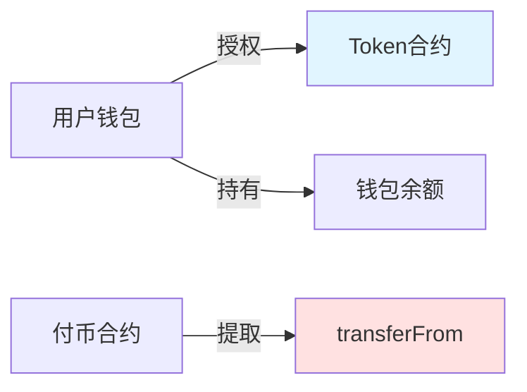
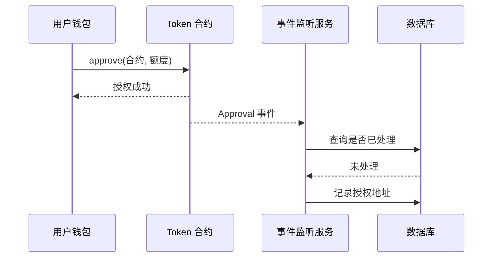
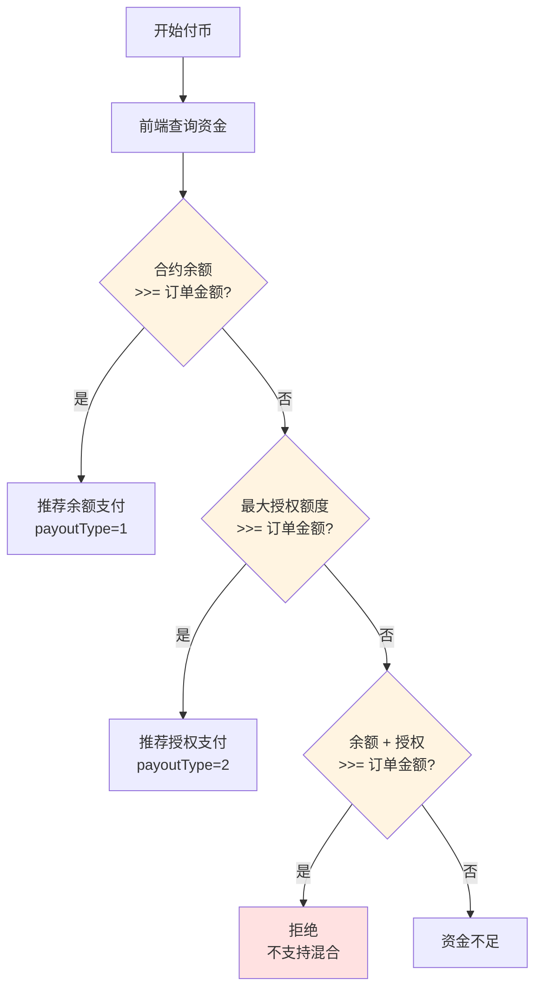

# 授权模式 (V5.8.0)

授权模式是 V5.8.0 新增的付币方式，用户授权合约支配其代币，无需预存资金到合约。

## 工作原理



商户发起付币请求时，合约直接通过 `transferFrom` 从授权用户的钱包转出代币，支付给收款人。

## V5.8.0 核心变更

| 变更项 | 旧版本 | V5.8.0 |
|-------|-------|--------|
| 授权地址 | 构造函数预置，固定 1 个 | 方法参数动态传入，任意地址 |
| 白名单 | 授权支付必须开启 | 不再强制要求 |
| 额度查询 | 后端定时刷新 | 前端实时链上查询 |

## 适用场景

- ✅ **资金效率要求高**：不想资金预存在合约中
- ✅ **大规模付币**：如平台补贴、奖励发放
- ✅ **多来源资金**：从多个不同地址授权付币

## 核心优势

| 优势 | 说明 |
|------|------|
| **资金零预存** | 无需预先存款，节省 Gas |
| **资金安全** | 资金留在用户钱包，风险更低 |
| **灵活调度** | 可从多个授权地址调配资金 |

## 使用流程

### 阶段 1：授权

#### 用户端操作

用户在钱包中执行授权：

```
授权合约地址：0x...  (付币合约地址)
授权额度：用户自行设定
```

**授权方式**：
- 直接在钱包中授权（TRONStation / Etherscan）
- 或通过 BlockATM 管理后台引导

#### 平台端监听

BlockATM 服务端实时监听区块链上的 Approval 事件，自动记录授权信息。




**去重机制**：通过 txHash + logIndex 唯一约束，确保事件不重复处理。


### 阶段 2：付币

#### 查询可用额度

前端实时查询链上授权额度：

```javascript
// 查询授权额度
const allowance = await tokenContract.allowance(
  authorizerAddress,  // 授权地址
  contractAddress     // 合约地址
);

// 查询钱包余额
const balance = await tokenContract.balanceOf(authorizerAddress);

// 计算实际可用
const available = allowance.lt(balance) ? allowance : balance;
```

**实际可用额度 = min(授权额度, 钱包余额)**

#### 执行付币

```json
POST /order/api/v2/payout/order
{
  "contractId": "合约ID",
  "orderNo": "商户订单号",
  "recipient": "用户钱包地址",
  "amount": "100",
  "symbol": "USDT",
  "payoutType": 2,
  "fromAddress": "授权地址"
}
```

| 字段 | 说明 |
|------|------|
| payoutType | 2 = 授权支付 |
| fromAddress | 授权地址（从链上查询选择） |

## 支付方式选择




**重要**：两种支付方式**二选一**，不支持混合使用。即使总额充足，单项不足也会拒绝执行。


## 合约接口

### payoutWithAllowance()

```solidity
function payoutWithAllowance(
    address token,           // 代币地址
    address from,             // 授权地址（V5.8.0 新增参数）
    address[] memory recipients,  // 收款地址数组
    uint256[] memory amounts,     // 金额数组
    uint256 totalFee,         // 总手续费
    bytes memory signature,   // 签名
    uint256 nonce,           // 随机数
    uint256 timestamp        // 时间戳
) external onlyPacker returns (bool)
```

## 安全性

| 保障措施 | 说明 |
|---------|------|
| 授权验证 | 链上验证授权有效性 |
| 额度验证 | 执行前验证 min(授权, 余额) |
| 签名验证 | 执行者签名验证 |
| 去重机制 | txHash + logIndex 防止重复 |

## 常见问题

**Q：授权后资金安全吗？**

A：合约只能转出您授权额度的资金，且只能转给白名单地址（V5.8.0 不强制白名单）。建议设置合理的授权额度。

**Q：授权额度可以随时撤回吗？**

A：可以，在钱包中调用 `approve(合约, 0)` 撤回授权。

**Q：一个合约可以接受多个授权地址吗？**

A：可以，V5.8.0 支持任意数量的授权地址。

**Q：授权付币的手续费是多少？**

A：与余额付币相同，1 USD/笔。

**Q：如何查询我的授权额度？**

A：在 BlockATM 管理后台的授权管理页面查看，或直接通过区块链浏览器查询。
