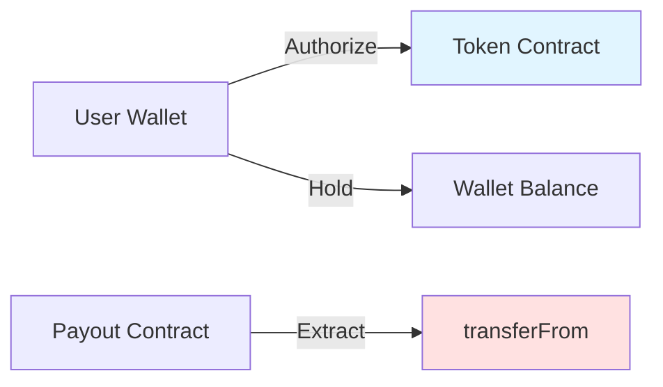
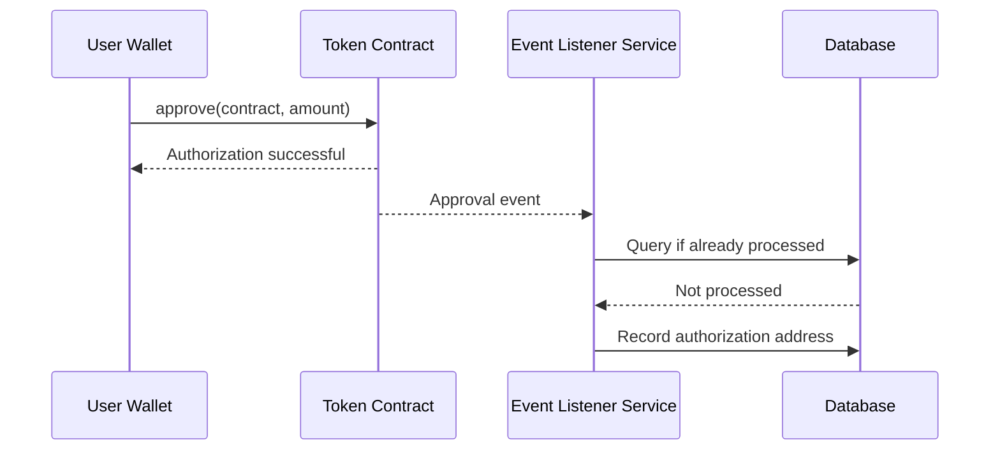
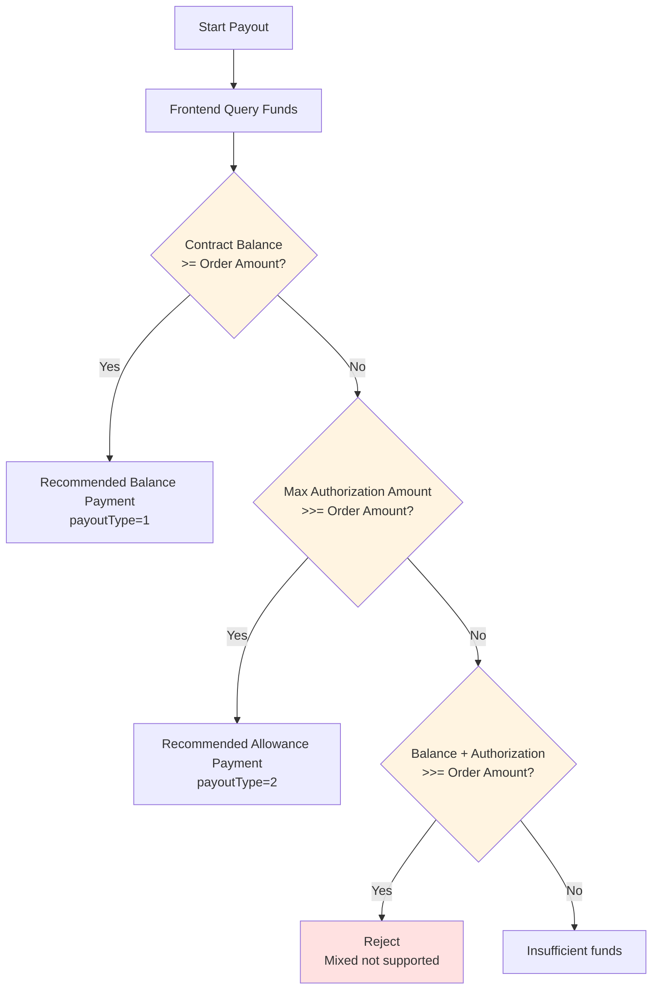

# Allowance Mode (V5.8.0)

Allowance mode is a payout method added in V5.8.0, where user authorizes contract to manage their tokens, no need to pre-deposit funds to the contract.

## How It Works



When merchant initiates payout request, contract directly transfers tokens from authorized user's wallet via `transferFrom`, paying to recipient.

## V5.8.0 Core Changes

| Change | Old Version | V5.8.0 |
|-------|-------|--------|
| Authorization Address | Constructor preset, fixed 1 | Method parameter dynamic input, any address |
| Whitelist | Authorization payment must enable | No longer mandatory |
| Amount Query | Backend timed refresh | Frontend real-time on-chain query |

## Applicable Scenarios

- ✅ **High capital efficiency requirement**: Don't want funds pre-deposited in contract
- ✅ **Large-scale payouts**: Such as platform subsidies, reward distribution
- ✅ **Multi-source funds**: Authorize payout from multiple different addresses

## Core Advantages

| Advantage | Description |
|------|------|
| **Zero Pre-deposit** | No need to pre-deposit, save Gas |
| **Fund Security** | Funds stay in user wallet, lower risk |
| **Flexible Scheduling** | Can allocate funds from multiple authorization addresses |

## Usage Flow

### Phase 1: Authorization

#### User Side Operation

User executes authorization in wallet:

```
Authorize contract address: 0x...  (payout contract address)
Authorization amount: User sets themselves
```

**Authorization Methods**:
- Authorize directly in wallet (TRONStation / Etherscan)
- Or guided by BlockATM admin dashboard

#### Platform Side Monitoring

BlockATM server monitors Approval events on blockchain in real-time, automatically records authorization info.




**Deduplication Mechanism**: Through txHash + logIndex unique constraint, ensure events are not processed repeatedly.


### Phase 2: Payout

#### Query Available Amount

Frontend queries on-chain authorization amount in real-time:

```javascript
// Query authorization amount
const allowance = await tokenContract.allowance(
  authorizerAddress,  // Authorization address
  contractAddress     // Contract address
);

// Query wallet balance
const balance = await tokenContract.balanceOf(authorizerAddress);

// Calculate actual available
const available = allowance.lt(balance) ? allowance : balance;
```

**Actual Available Amount = min(Authorization Amount, Wallet Balance)**

#### Execute Payout

```json
POST /order/api/v2/payout/order
{
  "contractId": "Contract ID",
  "orderNo": "Merchant order number",
  "recipient": "User wallet address",
  "amount": "100",
  "symbol": "USDT",
  "payoutType": 2,
  "fromAddress": "Authorization address"
}
```

| Field | Description |
|------|------|
| payoutType | 2 = Allowance Payment |
| fromAddress | Authorization address (selected from on-chain query) |

## Payment Method Selection




**Important**: The two payment methods are ** mutually exclusive**, mixed use not supported. Even if total amount is sufficient, if single item is insufficient, execution will be rejected.


## Contract Interface

### payoutWithAllowance()

```solidity
function payoutWithAllowance(
    address token,           // Token address
    address from,             // Authorization address (new parameter in V5.8.0)
    address[] memory recipients,  // Recipient address array
    uint256[] memory amounts,     // Amount array
    uint256 totalFee,         // Total handling fee
    bytes memory signature,   // Signature
    uint256 nonce,           // Nonce
    uint256 timestamp        // Timestamp
) external onlyPacker returns (bool)
```

## Security

| Safeguard | Description |
|---------|------|
| Authorization Verification | On-chain verification of authorization validity |
| Amount Verification | Verify min(authorization, balance) before execution |
| Signature Verification | Executor signature verification |
| Deduplication Mechanism | txHash + logIndex to prevent duplicates |

## FAQ

**Q: Are funds safe after authorization?**

A: Contract can only transfer the authorized amount, and can only transfer to whitelist addresses (whitelist not mandatory in V5.8.0). Recommended to set reasonable authorization amount.

**Q: Can I revoke authorization anytime?**

A: Yes, call `approve(contract, 0)` in wallet to revoke authorization.

**Q: Can one contract accept multiple authorization addresses?**

A: Yes, V5.8.0 supports unlimited authorization addresses.

**Q: What is the handling fee for allowance payout?**

A: Same as balance payout, 1 USD/order.

**Q: How to query my authorization amount?**

A: View in authorization management page in BlockATM admin dashboard, or query directly via blockchain explorer.
