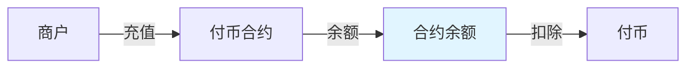

# 余额模式

余额模式是最基础的付币方式，资金预先存入合约，付币时从合约余额扣除。

## 工作原理



商户将代币充值到合约地址，形成合约余额。发起付币时，从合约余额中扣除相应金额转给用户。

## 适用场景

- ✅ **日常高频付币**：如工资发放、奖励发放
- ✅ **资金已归集**：商户已有大量资金在合约中
- ✅ **固定金额批量付币**：如返利、补贴发放

## 核心优势

| 优势 | 说明 |
|------|------|
| **即时可用** | 充值后立即可用于付币 |
| **Gas 效率高** | 单笔付币 Gas 消耗较低 |
| **资金集中** | 便于统一管理和对账 |

## 使用流程

### 1. 创建合约

在 BlockATM 管理后台创建余额模式付币合约。

### 2. 充值

将代币从您的钱包转入合约地址：

```
合约地址：0x...  (从管理后台获取)
充值金额：您希望的预存金额
```


**注意**：充值后资金在合约中，请确保合约地址安全。

**Gas**：TRON 网络充值无需额外 Gas；Ethereum 网络需要支付 Gas。


### 3. 创建付币订单

```json
POST /order/api/v2/payout/order
{
  "contractId": "合约ID",
  "orderNo": "商户订单号",
  "recipient": "用户钱包地址",
  "amount": "100",
  "symbol": "USDT",
  "payoutType": 1
}
```

| 字段 | 说明 |
|------|------|
| payoutType | 1 = 余额支付 |

### 4. 执行付币

管理后台审核后执行付币，合约余额扣除相应金额。

## 额度计算

```
实际可用额度 = 合约余额 - 已锁定金额
```


**已锁定金额**：正在执行中的付币订单所冻结的金额。


## 与授权模式对比

| 对比项 | 余额模式 | 授权模式 |
|-------|---------|---------|
| 资金位置 | 合约 | 用户钱包 |
| 充值/授权 | 充值到合约 | 用户授权合约 |
| 资金风险 | 合约被盗风险 | 用户钱包风险 |
| 资金效率 | 资金需预存 | 无需预存 |
| 白名单要求 | 必须 | V5.8.0 不强制 |

## 常见问题

**Q：余额模式支持哪些代币？**

A：支持所有 ERC20/TRC20/ARB20 代币。

**Q：可以部分使用余额、部分使用授权吗？**

A：不可以，两种方式必须选择一种。

**Q：合约余额有上限吗？**

A：没有上限，但建议单笔付币金额不要过大。

**Q：充值后多久可以用于付币？**

A：TRON 网络立即可用；Ethereum 需等待一个区块确认。
