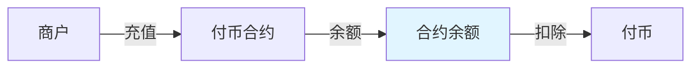
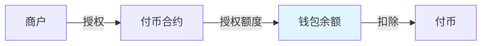

# 付币方式


## 工作原理

#### 余额付币



商户将代币充值到合约地址，形成合约余额。发起付币时，从合约余额中扣除相应金额转给用户。

####

#### 授权付币



## 核心优势

<table><thead><tr><th>对比项</th><th>余额模式</th><th width="251.375">授权模式</th></tr></thead><tbody><tr><td><strong>资金来源</strong></td><td>合约余额</td><td>已授权钱包</td></tr><tr><td><strong>充值/授权</strong></td><td>充值到合约</td><td>用户授权合约</td></tr><tr><td><strong>最大可用资金</strong></td><td>合约全部余额</td><td>已授权钱包（已授权额度/钱包余额）最小值</td></tr><tr><td><strong>资金风险</strong></td><td>合约被盗风险</td><td>用户钱包风险</td></tr><tr><td><strong>资金效率</strong></td><td>资金需预存</td><td>无需预存</td></tr><tr><td><strong>白名单要求</strong></td><td>必须</td><td>不强制</td></tr><tr><td><strong>适用场景</strong></td><td><p>✅ <strong>日常高频付币</strong>：如工资发放、奖励发放</p><p>✅ <strong>资金已归集</strong>：商户已有大量资金在合约中</p><p>✅ <strong>固定金额批量付币</strong>：如返利、补贴发放</p></td><td><p>✅ <strong>大客户付币</strong>：如B2B转账、大额奖励发放</p><p>✅ <strong>冷钱包隔离</strong>：无需多次转移资金，仅需调整授权额度</p><p>✅ <strong>资金分账</strong>：如公司分红、补贴发放</p></td></tr></tbody></table>

## 使用流程

### 1. 创建合约

在 BlockATM 管理后台创建付币合约。

### 2. 充值 / 增加（调整）授权钱包

#### 余额付币：充值

将代币从您的钱包转入合约地址：

```
合约地址：0x...  (从管理后台获取)
充值金额：您希望的预存金额
```


**注意**：充值后资金在合约中，请确保合约地址安全。

**Gas**：TRON 网络充值无需额外 Gas；Ethereum 网络需要支付 Gas。


#### 合约充币页面

<figure><figcaption></figcaption></figure>

#### 授权付币：调整授权额度

在执行授权付币前，您需要通过管理后台授权合约调配您钱包中的资产额度：

1. **进入页面：**&#x767B;录 BlockATM 管理后台，进入 \[授权管理] 菜单。
2. **连接钱包：**&#x9009;择并连接您用于付币的商户钱包地址。
3. **调整额度：**&#x8F93;入您允许合约调配的最大代币数量并“确认授权”。
4. **链上确认：**&#x5728;弹出窗口中完成签名授权。


**当前授权额度：**&#x53EF;随时在授权管理页面查看剩余可用额度。 \
\
**注意：**&#x6388;权后资金仍留在您的个人钱包中，合约仅在发起付币订单时按需扣除。


**授权管理页面**

<figure><figcaption></figcaption></figure>

### 3. 创建付币订单

```json
POST /order/api/v2/payout/order
{
  "contractId": "合约ID",
  "orderNo": "商户订单号",
  "recipient": "用户钱包地址",
  "amount": "100",
  "symbol": "USDT",
}
```

### 4. 执行付币

管理后台审核后执行付币：

* 余额支付：从合约余额中扣除相应金额。
* 授权支付：利用已授权额度，直接从商户授权钱包中扣除相应金额。

| 字段         | 说明                  |
| ---------- | ------------------- |
| payoutType | 1 = 余额支付 （从合约余额扣除）  |
|            | 2 = 授权支付（从商户授权钱包扣除） |

#### 余额付币窗口

<figure><figcaption></figcaption></figure>

#### 授权付币窗口

<figure><figcaption></figcaption></figure>

## 额度计算

```
余额模式
实际可用额度 = 合约余额 - 已锁定金额
```

```
授权模式
实际可用额度 = min(钱包余额, 剩余授权额度) - 已锁定金额

min(钱包余额, 剩余授权额度)：授权模式下，实际可发出的款项受限于“钱包里实际拥有的钱”和“你给合约开出的授权额度”中的最小值。
```


**已锁定金额**：正在执行中的付币订单所冻结的金额。



## 常见问题

**Q：余额模式支持哪些代币？**

A：支持所有 ERC20/TRC20/ARB20 代币。

**Q：可以部分使用余额、部分使用授权吗？**

A：不可以，两种方式必须选择一种。\
\
**Q：为什么我的钱包有钱，但付币订单提示余额不足？**\
\
A：请检查“授权管理”页面。如果您的“剩余授权额度”小于订单金额，即使钱包余额充足，合约也无法调配资金。此时需要调大授权额度。

**Q：调整授权额度需要支付 Gas 费吗？**\
\
A：需要。调整授权额度属于链上交互（Approve 动作），需要根据对应网络支付少量的 Gas 费用。

**Q：合约余额有上限吗？**

A：没有上限，但建议单笔付币金额不要过大。

**Q：充值后多久可以用于付币？**

A：TRON 网络立即可用；Ethereum 需等待一个区块确认。\
\
**Q：取消授权后，未完成的订单会怎样？**\
\
A：如果订单已在审核执行中，取消授权会导致扣款失败，订单将转为异常状态。建议在所有待处理订单完成后再撤销授权。
