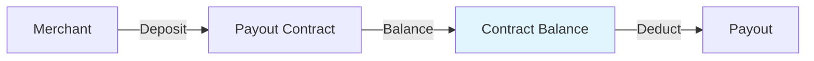

# Balance Mode

Balance mode is the most basic payout method, funds are pre-deposited to contract, deducted from contract balance when paying out.

## How It Works



Merchant transfers tokens from wallet to contract address, forming contract balance. When initiating payout, deduct corresponding amount from contract balance and transfer to user.

## Applicable Scenarios

- ✅ **Daily high-frequency payouts**: Such as salary distribution, reward distribution
- ✅ **Funds already consolidated**: Merchant already has large funds in contract
- ✅ **Fixed-amount batch payouts**: Such as rebates, subsidy distribution

## Core Advantages

| Advantage | Description |
|------|------|
| **Immediately Available** | Can be used for payout immediately after deposit |
| **High Gas Efficiency** | Low Gas consumption for single payout |
| **Centralized Management** | Convenient for unified management and reconciliation |

## Usage Flow

### 1. Create Contract

Create balance mode payout contract in BlockATM admin dashboard.

### 2. Deposit

Transfer tokens from your wallet to contract address:

```
Contract address: 0x...  (obtained from admin dashboard)
Deposit amount: your desired pre-deposit amount
```


**Note**: After deposit, funds are in the contract, please ensure contract address security.

**Gas**: TRON network deposit does not require additional Gas; Ethereum network needs to pay Gas.


### 3. Create Payout Order

```json
POST /order/api/v2/payout/order
{
  "contractId": "Contract ID",
  "orderNo": "Merchant order number",
  "recipient": "User wallet address",
  "amount": "100",
  "symbol": "USDT",
  "payoutType": 1
}
```

| Field | Description |
|------|------|
| payoutType | 1 = Balance Payment |

### 4. Execute Payout

After admin dashboard review, execute payout, contract balance deducts corresponding amount.

## Amount Calculation

```
Actual Available = Contract Balance - Locked Amount
```


**Locked Amount**: Amount frozen by payout orders currently being executed.


## Comparison with Allowance Mode

| Comparison | Balance Mode | Allowance Mode |
|-------|---------|---------|
| Fund Location | Contract | User wallet |
| Deposit/Authorization | Deposit to contract | User authorizes contract |
| Fund Risk | Contract stolen risk | User wallet risk |
| Fund Efficiency | Need to pre-deposit | No pre-deposit required |
| Whitelist Required | Must | V5.8.0 not mandatory |

## FAQ

**Q: What tokens does balance mode support?**

A: Supports all ERC20/TRC20/ARB20 tokens.

**Q: Can I use part balance and part allowance?**

A: No, the two methods must be chosen one.

**Q: Is there an upper limit for contract balance?**

A: No upper limit, but recommended not to make single payout amount too large.

**Q: How long after deposit can it be used for payout?**

A: TRON network immediately available; Ethereum needs to wait for one block confirmation.
