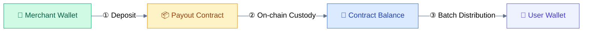
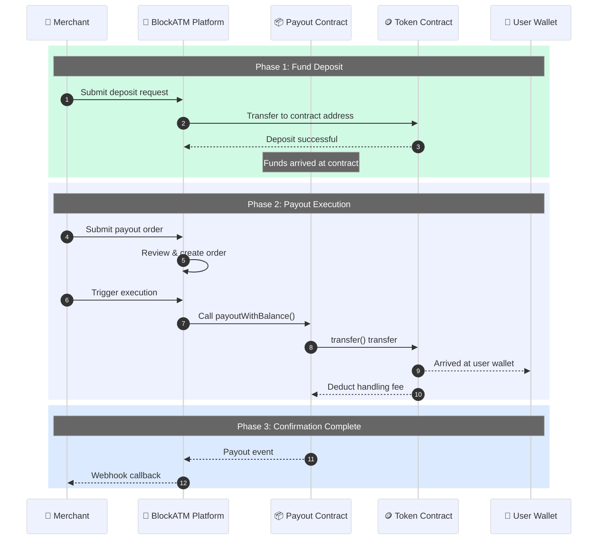
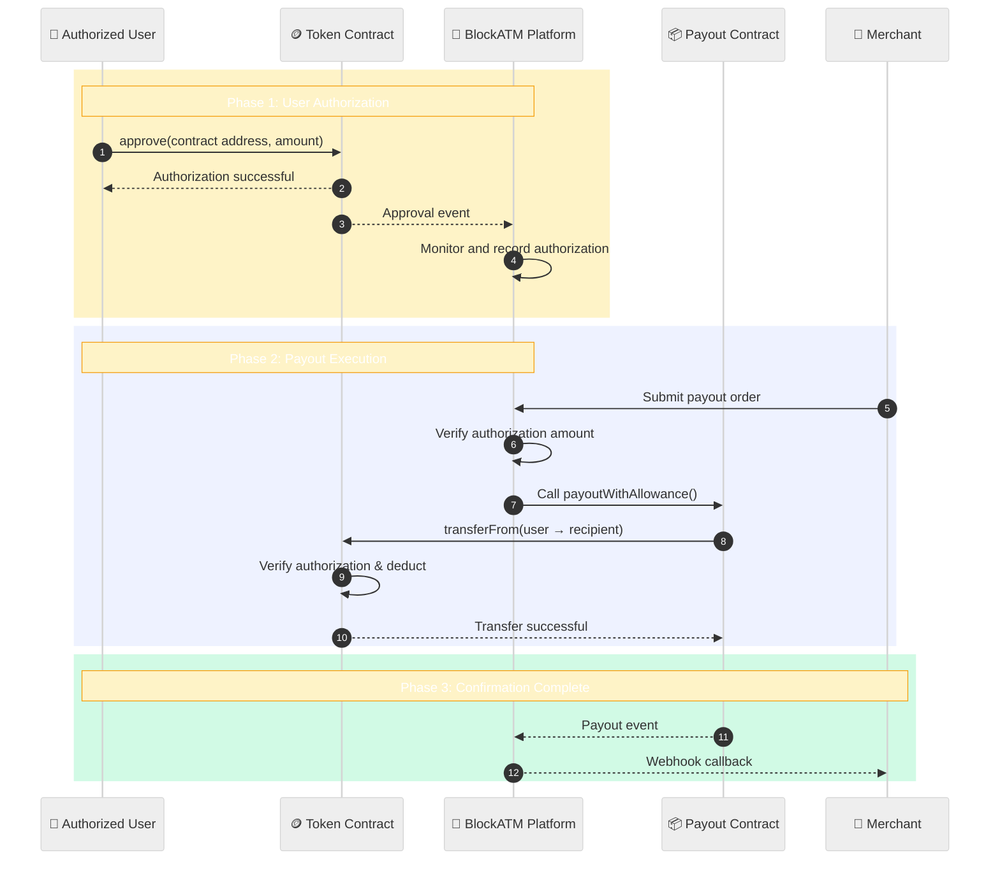
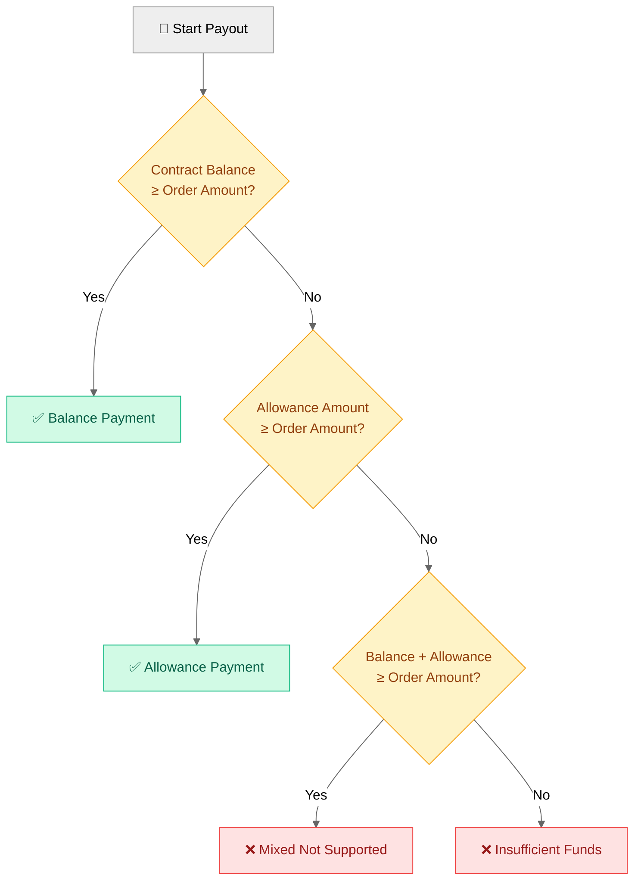

# Payout How It Works

Understand the complete workflow of Batch Payout.

## Fund Flow

## Balance Mode Flow

### Complete Sequence Diagram

## Allowance Mode Flow

### Complete Sequence Diagram


**V5.8.0 Feature**: In allowance mode, whitelist is no longer mandatory, any address can be used as authorization source.


## Balance vs Allowance Comparison

| Dimension | Balance Mode | Allowance Mode |
|:---|:---|:---|
| **Fund Location** | Contract balance | User wallet balance |
| **Authorization Required** | None | Pre-authorization required |
| **Fund Risk** | Funds locked in contract | Funds under user control |
| **Flexibility** | Need to pre-deposit funds | More flexible and immediate |
| **Recommended Scenario** | High-frequency fixed-amount payouts | Large-scale scattered fund payouts |

## Payment Method Selection Rules


**Important**: Balance payment and allowance payment are ** mutually exclusive**, mixed payment not supported.


## Contract Roles

| Role | Description | Permissions |
|------|------|------|
| **Owner** | Contract creator | Manage contract configuration |
| **Packer** | Packing executor | Execute payout transactions |
| **Finance** | Finance address | Authorized to withdraw funds from contract |
| **ColdWallet** | Cold wallet address | V5.8.0 can be dynamically specified |

## Exception Handling

| Situation | Handling Method |
|------|---------|
| Insufficient balance | Prompt to deposit or switch to allowance mode |
| Insufficient authorization | Prompt to increase authorization amount |
| Chain congestion | Wait for confirmation, can query on-chain status |
| Signature verification failed | Check signature address and signature content |

## Next Steps

- [Balance mode details →](balance-mode.md)
- [Allowance mode details →](allowance-mode.md)
- [View contract interface →](contract.md)
