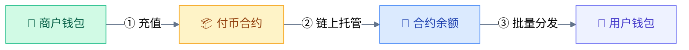
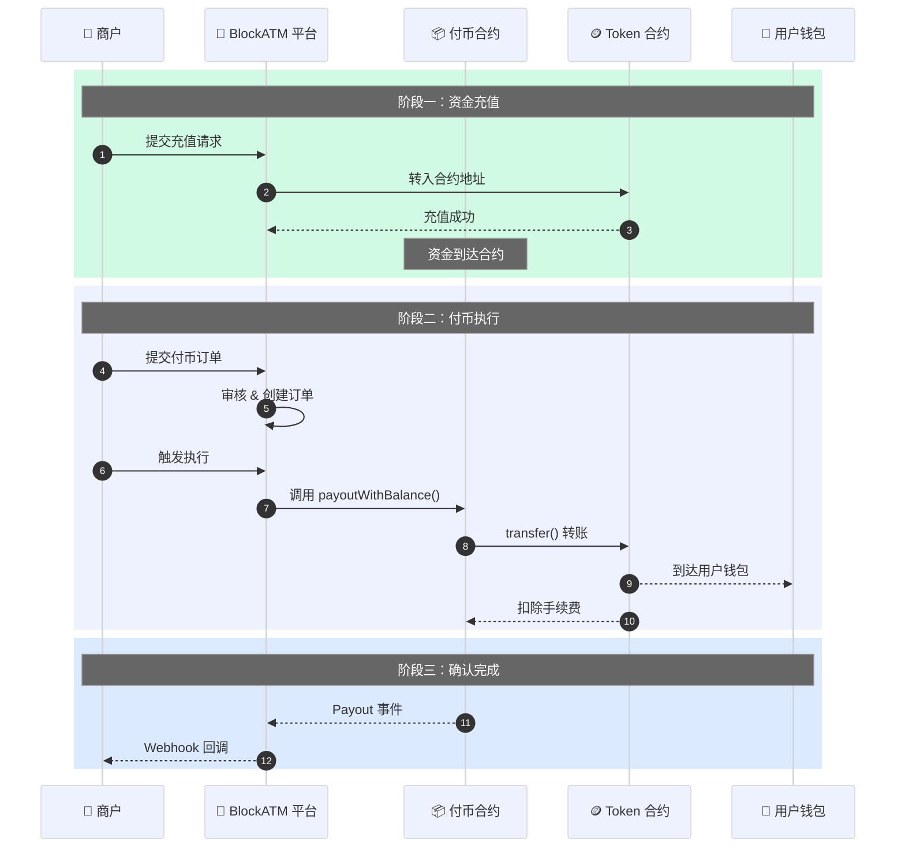
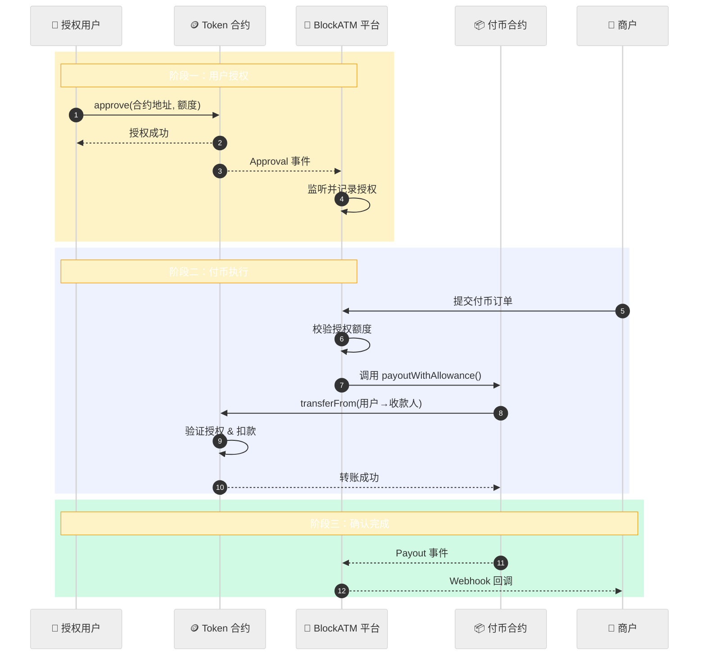
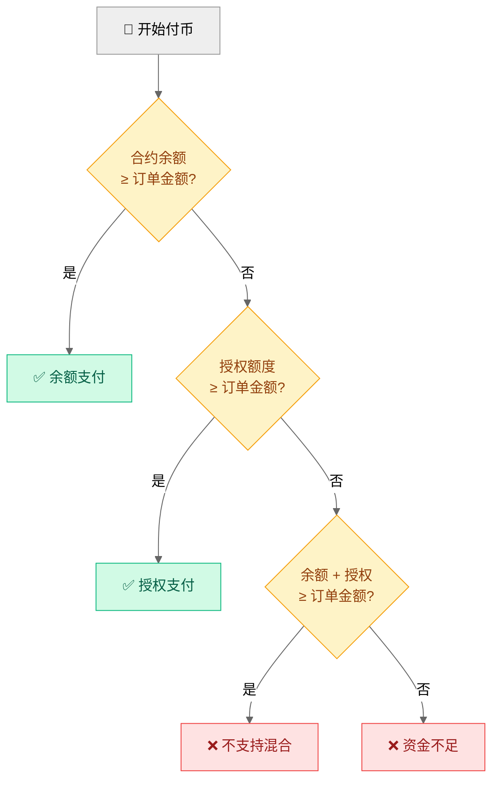

# 付币工作原理

了解 Batch Payout 付币的完整工作流程。

## 资金流向

## 余额模式流程

### 完整时序图

## 授权模式流程

### 完整时序图

## 余额 vs 授权对比

| 维度 | 余额模式 | 授权模式 |
|:---|:---|:---|
| **资金位置** | 合约余额 | 用户钱包余额 |
| **授权需要** | 无需 | 需预先授权 |
| **资金风险** | 资金锁在合约中 | 资金在用户控制 |
| **灵活性** | 需预存资金 | 更灵活即时 |
| **推荐场景** | 高频固定金额付币 | 大规模分散资金付币 |

## 支付方式选择规则


**重要**：余额支付和授权支付**二选一**，不支持混合支付。


## 合约角色

| 角色 | 说明 | 权限 |
|------|------|------|
| **Owner** | 合约创建者 | 管理合约配置 |
| **Packer** | 打包执行者 | 执行付币交易 |
| **Finance** | 财务地址 | 有权从合约提取资金 |
| **ColdWallet** | 冷钱包地址 | 可动态指定 |

## 异常处理

| 情况 | 处理方式 |
|------|---------|
| 余额不足 | 提示充值或切换授权模式 |
| 授权不足 | 提示增加授权额度 |
| 链上拥堵 | 等待确认，可查询链上状态 |
| 签名验证失败 | 检查签名地址和签名内容 |

## 下一步

- [余额模式详解 →](balance-mode.md)

- [查看合约接口 →](contract.md)
