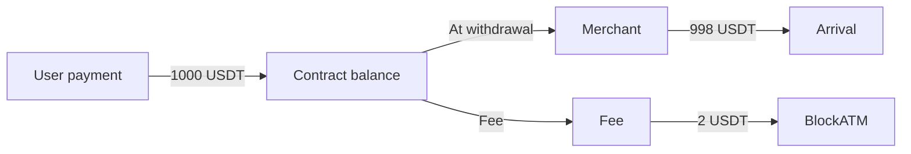

# Collection Fee Description

Safepay collection service detailed fee description.

## Fee Overview

| Type | Fee | Charge Timing |
|------|------|---------|
| Create collection contract | 200 USD/contract | When creating contract |
| Wallet connect payment | 2 USD/order | When withdrawing funds |
| Scan payment | 0.4%/order | When withdrawing funds |


**Fee Currency**: All fees are charged in stablecoins (such as USDT, USDC), exchange rate fixed at 1:1.


## Detailed Description

### Contract Creation Fee

200 USD service fee is charged for each collection contract created.

| Contract Type | Fee |
|---------|------|
| Web3 Collection Contract | 200 USDT |
| Scan2Pay Contract | 200 USDT |


**Scan2Pay Contract**: Scan2Pay contract needs to associate with Web3 collection contract, so creating Scan2Pay is equivalent to having a Web3 collection contract at the same time.


### Transaction Fees

#### Wallet Connect Payment

| Fee Item | Amount |
|-------|------|
| Fixed fee | 2 USD/order |

**Example**: User pays 1000 USDT via wallet connect, fee is 2 USDT, actual arrival is 998 USDT.

#### QR Code Payment

| Fee Item | Rate |
|-------|------|
| Percentage fee | 0.4%/order |

**Example**: User pays 1000 USDC via scan, fee is 4 USDC (1000 × 0.4%), actual arrival is 996 USDC.

## Fee Calculation Examples

### Scenario 1: E-commerce Collection

User purchases goods worth 100 USD, chooses wallet connect payment:

```
Goods amount: 100 USD
Fee: 2 USD
User actually pays: 102 USD
Merchant actually receives: 100 USD
```

### Scenario 2: Scan Collection

User purchases goods worth 500 USD, chooses scan payment:

```
Goods amount: 500 USD
Fee: 500 × 0.4% = 2 USD
User actually pays: 502 USD
Merchant actually receives: 500 USD
```

### Scenario 3: Batch User Payment Collection

Multiple users pay to the same contract, merchant withdraws and fees are calculated by total count:

```
User A payment: 100 USDT (wallet connect)
User B payment: 200 USDT (scan)
User C payment: 300 USDT (wallet connect)

Total fee: (2 + 200×0.4% + 2) = 6 USDT
```

## Fee Deduction Method


**Important**: Collection fees are deducted when merchant withdraws from contract, not when user pays.




## Comparison with Payout Fees

| Comparison | Collection | Payout |
|-------|------|------|
| Create contract | 200 USD | 200 USD |
| Transaction fee | 2 USD or 0.4% | 1 USD |
| Fee bearer | Merchant | Merchant |

## FAQ

**Q: Can user see the fee when paying?**

A: User sees the direct payment amount, fee is borne by merchant. Merchant can display "fee included" price to user at the application layer.

**Q: Can I customize the fee rate?**

A: Currently customization not supported, fee standard is fixed.

**Q: Do I need to pay fees in test environment?**

A: Test environment uses test tokens, no actual fees.
