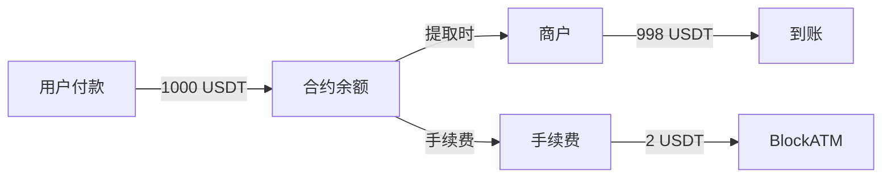

# 费用说明

Safepay 收币服务的详细费用说明。

## 费用概览

| 类型     | 费用        | 收费时机  |
| ------ | --------- | ----- |
| 创建收币合约 | 200 USD/个 | 合约创建时 |
| 钱包连接支付 | 2 USD/笔   | 资金提取时 |
| 扫码支付   | 0.4%/笔    | 资金提取时 |


**费用币种**：所有费用以稳定币（如 USDT、USDC）收取，汇率固定为 1:1。


## 详细说明

### 创建合约费用

每创建一个收币合约，收取 200 USD 的服务费。

| 合约类型        | 费用       |
| ----------- | -------- |
| Web3 收款合约   | 200 USDT |
| Scan2Pay 合约 | 200 USDT |


**Scan2Pay 合约**需要关联 Web3 收款合约，因此创建 Scan2Pay 相当于同时拥有一个 Web3 收款合约。


### 交易手续费

#### 钱包连接支付

| 费用项   | 金额      |
| ----- | ------- |
| 固定手续费 | 2 USD/笔 |

**示例**：用户通过钱包连接方式支付 1000 USDT，手续费为 2 USDT，实际到账 998 USDT\
(仅在提币时结算）。

#### 扫码支付

| 费用项   | 费率     |
| ----- | ------ |
| 比例手续费 | 0.4%/笔 |

**示例**：用户通过扫码方式支付 1000 USDC，手续费为 4 USDC (1000 × 0.4%)，实际到账 996 USDC\
(仅在提币时结算）。

## 费用计算示例

### 场景 1：电商收款

用户购买价值 100 USD 的商品，选择钱包连接支付：

```
商品金额：100 USD
手续费：2 USD
用户实际支付：102 USD
商户实际到账：100 USD
```

### 场景 2：扫码收款

用户购买价值 500 USD 的商品，选择扫码支付：

```
商品金额：500 USD
手续费：500 × 0.4% = 2 USD
用户实际支付：502 USD
商户实际到账：500 USD
```

### 场景 3：批量用户付款归集

多个用户付款到同一合约，商户提取时按总笔数计算手续费：

```
用户 A 付款：100 USDT（钱包连接）
用户 B 付款：200 USDT（扫码）
用户 C 付款：300 USDT（钱包连接）

总手续费：(2 + 200×0.4% + 2) = 6 USDT
```

## 费用扣除方式


**重要**：收币手续费在商户从合约提取资金时扣除，而非用户支付时扣除。




#### WEB3收币合约提币

<div align="left"><figure><figcaption></figcaption></figure></div>

#### 扫码收币合约提币

<div align="left"><figure><figcaption></figcaption></figure></div>

| 对比项   | 收币           | 付币      |
| ----- | ------------ | ------- |
| 创建合约  | 200 USD      | 200 USD |
| 交易手续费 | 2 USD 或 0.4% | 1 USD   |
| 收费对象  | 商户           | 商户      |

## 常见问题

**Q：用户支付时能看到手续费吗？**

A：用户看到的是直接支付金额，手续费由商户承担。商户可以在应用层面向用户展示"包含手续费"的价格。

**Q：手续费在什么时候扣除？**

A：商户在从合约中提币时计算并扣除手续费

**Q：可以自定义手续费率吗？**

A：当前不支持自定义，费用标准固定。

**Q：测试环境需要支付手续费吗？**

A：测试环境使用测试代币，没有实际费用。
