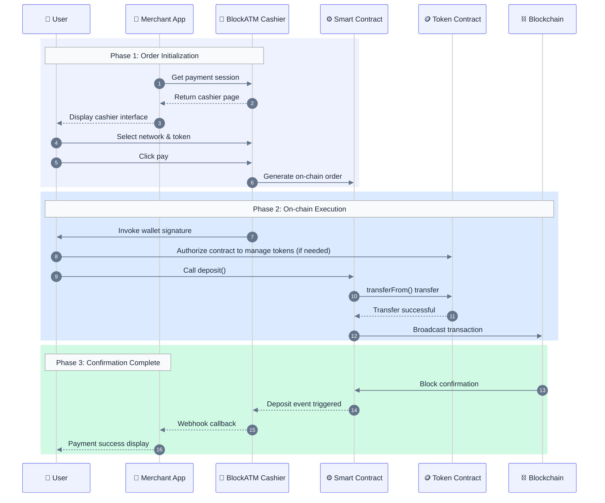
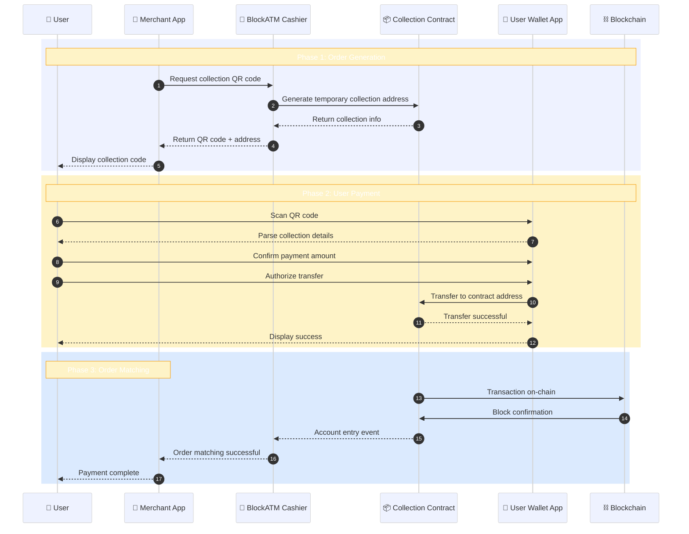

# Collection How It Works

Understand the complete workflow of Safepay collection.

## Fund Flow

```mermaid
%%{
  init: {
    'theme': 'neutral',
    'themeVariables': {
      'primaryColor': '#6366F1',
      'lineColor': '#64748B'
    }
  }
}%%
graph LR
    A["👤 User Wallet"] -->|"① Transfer"| B["📦 Collection Contract"]
    B -->|"② On-chain Custody"| C["💎 Contract Balance"]
    C -->|"③ Withdraw as Needed"| D["🏦 Merchant Wallet"]

    style A fill:#EEF2FF,stroke:#6366F1,color:#4338CA
    style B fill:#FEF3C7,stroke:#F59E0B,color:#92400E
    style C fill:#DBEAFE,stroke:#3B82F6,color:#1E40AF
    style D fill:#D1FAE5,stroke:#10B981,color:#065F46
```

## Web3 Collection Flow

### Complete Sequence Diagram

### Key Steps Description

1. **Create Order**: Cashier generates on-chain order, records amount, token type, merchant info
2. **Wallet Authorization**: On first payment, user authorizes contract to manage their tokens
3. **On-chain Transfer**: After user signs and confirms, tokens atomically transferred from user wallet to contract
4. **Event Monitoring**: Contract triggers `Deposit` event, BlockATM on-chain monitoring service captures it
5. **Status Sync**: Order status updated, Webhook notifies merchant system

## Scan2Pay Flow

### Complete Sequence Diagram


**Important**: When using Scan2Pay, user must ensure payment amount exactly matches order amount, otherwise order may fail to automatically match.


## Contract Address Roles

| Role | Description | Setting Time |
|------|------|---------|
| **Owner** | Contract creator, can manage contract configuration | When creating contract |
| **Signer** | Address authorized to withdraw funds from contract | When creating contract |
| **Receiver** | Address where funds ultimately arrive | When creating contract |

## Exception Handling

| Situation | Handling Method |
|------|---------|
| User not authorized | Prompt user to complete authorization and retry |
| Blockchain congestion | Wait for confirmation, can query on-chain status |
| Amount mismatch | Scan2Pay order may fail to auto-match |
| Order timeout | Cashier displays timeout, user can re-initiate payment |

## Next Steps

- [View contract interface →](contract.md)
- [View fee description →](fees.md)
- [Integrate collection →](../../integration/guides/collect-guide.md)
