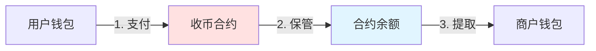
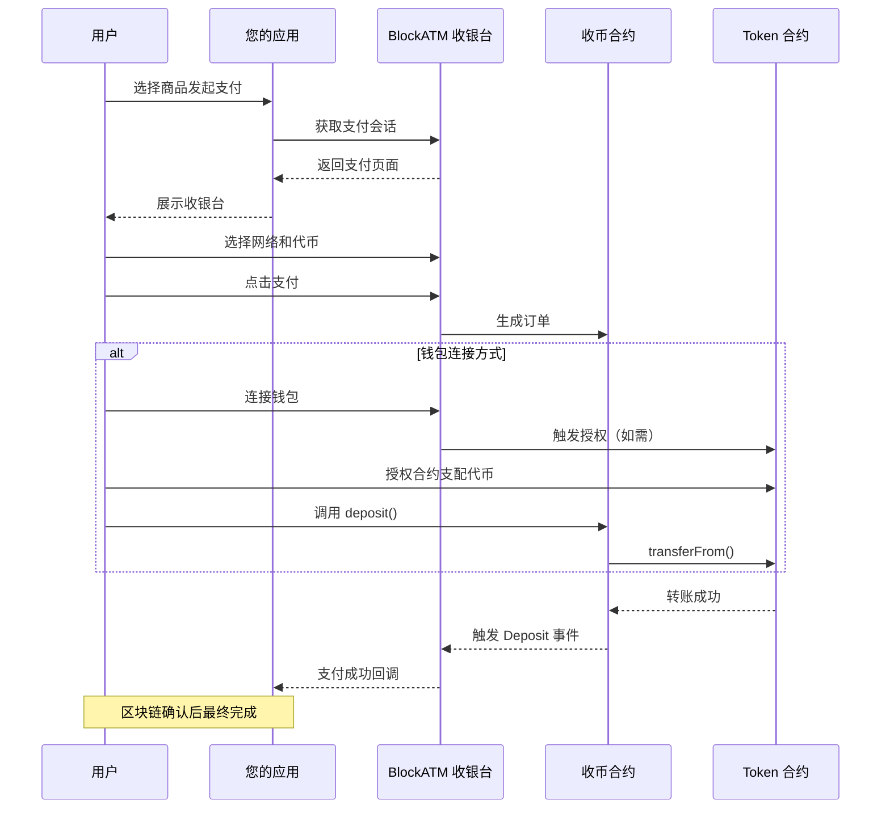
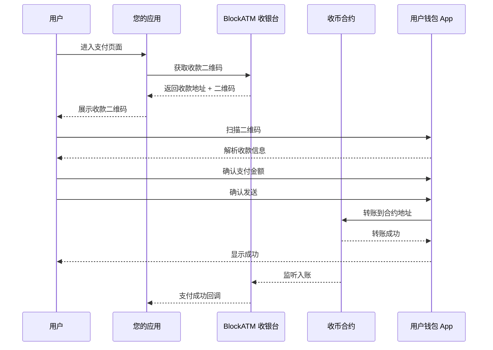

# 收币工作原理

了解 Safepay 收币的完整工作流程。

## 资金流向

## Web3 收款流程

### 完整时序图

### 关键步骤说明

1. **创建订单**：收银台生成订单，包含金额、代币类型等
2. **用户授权**：首次支付时，用户授权合约支配其代币
3. **链上转账**：用户确认后，代币从用户钱包转入合约
4. **事件通知**：合约触发事件，BlockATM 更新订单状态
5. **回调通知**：您的系统收到 Webhook 通知

## Scan2Pay 流程

### 完整时序图


**重要**：用户在使用 Scan2Pay 时，必须确保支付金额与订单金额完全一致，否则可能导致订单无法匹配。


## 合约地址角色

| 角色 | 说明 | 设置时机 |
|------|------|---------|
| **Owner** | 合约创建者，可管理合约配置 | 创建合约时 |
| **Signer** | 有权从合约提取资金的地址 | 创建合约时 |
| **Receiver** | 资金最终到达的地址 | 创建合约时 |

## 异常处理

| 情况 | 处理方式 |
|------|---------|
| 用户未授权 | 提示用户完成授权后重试 |
| 区块链拥堵 | 等待确认，可查询链上状态 |
| 金额不匹配 | Scan2Pay 订单可能无法自动关联 |
| 订单超时 | 收银台显示超时，用户可重新发起支付 |

## 下一步

- [查看合约接口 →](contract.md)
- [查看费用说明 →](fees.md)
- [集成收币 →](../../integration/guides/collect-guide.md)
