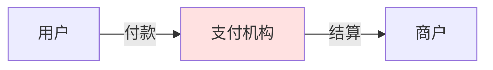
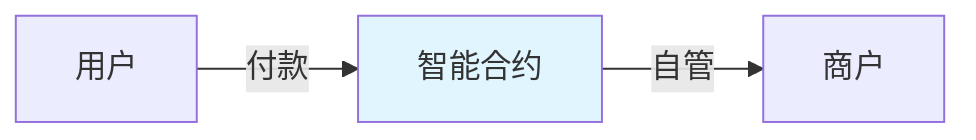

# 自托管说明

BlockATM 采用去中心化自托管模式，您的资产完全由您控制。

## 核心原理

### 传统支付

**问题**：
- 资金由支付机构托管
- 提取受限（金额、时间）
- 需要信任机构

### BlockATM

**优势**：
- 资金存储在智能合约
- 合约规则公开透明
- 只有您能控制资金

## 资金控制权

### 合约权限

| 角色 | 能做什么 | 不能做什么 |
|------|---------|----------|
| **您（Owner）** | 管理合约配置 | 动用合约资金 |
| **签名者（Signer）** | 提取资金到预设地址 | 转到其他地址 |
| **BlockATM** | ❌ 什么都不能 | ❌ 动用资金 |


**BlockATM 无法访问您的资金**：即使我们想，也无法动用您合约中的代币。


## 安全保证

### 技术保证

| 保障 | 说明 |
|------|------|
| 智能合约 | 部署在区块链上，代码公开透明 |
| 签名验证 | 所有操作需要有效签名 |
| 白名单 | 资金只能转到预设地址 |

### 操作保证

| 操作 | 要求 |
|------|------|
| 创建合约 | 您控制 Owner 地址 |
| 提取资金 | 您控制 Signer 签名 |
| 修改配置 | 您控制 Owner 私钥 |

## 自托管的责任


**重要**：自托管意味着您对资金安全负全部责任。请务必：

1. **安全保管密钥**：Owner 和 Signer 的私钥/助记词必须安全保管
2. **不要泄露**：不要向任何人透露您的密钥
3. **备份**：做好密钥备份，防止丢失
4. **谨慎操作**：合约配置一旦设置通常无法修改


## 对比总结

| 对比项 | 传统支付 | BlockATM |
|-------|---------|----------|
| 资金托管 | 机构托管 | 智能合约自管 |
| 提取控制 | 机构控制 | 您完全控制 |
| 提取限制 | 有金额/时间限制 | 无限制 |
| 资金风险 | 机构风险 | 您自己负责 |
| 透明度 | 不透明 | 完全透明 |
