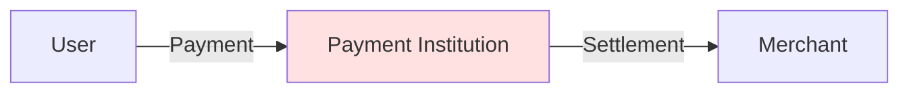
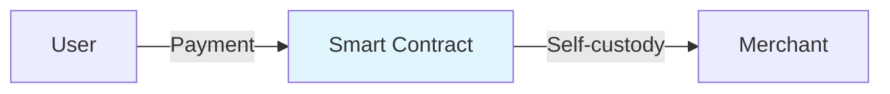

# Self-custody Description

BlockATM uses decentralized self-custody model, your assets are completely under your control.

## Core Principle

### Traditional Payment

**Problems**:
- Funds custodied by payment institution
- Withdrawal restrictions (amount, time)
- Need to trust institution

### BlockATM

**Advantages**:
- Funds stored in smart contract
- Contract rules public and transparent
- Only you can control funds

## Fund Control

### Contract Permissions

| Role | Can Do | Cannot Do |
|------|---------|----------|
| **You (Owner)** | Manage contract configuration | Use contract funds |
| **Signer** | Withdraw funds to preset address | Transfer to other addresses |
| **BlockATM** | ❌ Nothing | ❌ Use funds |


**BlockATM cannot access your funds**: Even if we wanted to, we cannot use tokens in your contract.


## Security Guarantee

### Technical Guarantee

| Safeguard | Description |
|------|------|
| Smart Contract | Deployed on blockchain, code public and transparent |
| Signature Verification | All operations require valid signature |
| Whitelist | Funds can only be transferred to preset addresses |

### Operational Guarantee

| Operation | Requirement |
|------|------|
| Create contract | You control Owner address |
| Withdraw funds | You control Signer signature |
| Modify configuration | You control Owner private key |

## Self-custody Responsibilities


**Important**: Self-custody means you bear full responsibility for fund security. Please be sure to:

1. **Securely store keys**: Owner and Signer private keys/recovery phrases must be securely stored
2. **Do not disclose**: Do not reveal your keys to anyone
3. **Backup**: Make backup of keys to prevent loss
4. **Be cautious with operations**: Contract configuration once set usually cannot be modified


## Comparison Summary

| Comparison | Traditional Payment | BlockATM |
|-------|---------|----------|
| Fund Custody | Institution custodied | Smart contract self-custody |
| Withdrawal Control | Institution controlled | Completely under your control |
| Withdrawal Limits | Amount/time limits | No limits |
| Fund Risk | Institution risk | Your own responsibility |
| Transparency | Not transparent | Completely transparent |
